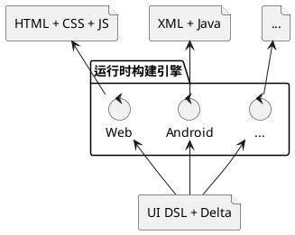
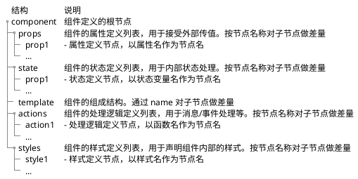

import {Table, TRow, TCol} from '@site/src/components/Table';
import Header from '@site/docs/\_header.md';

<Header />

设计核心原则：

- 框架中立：逻辑层与表现层分离，逻辑层只关注（应用/组件）状态的迁移，表现层仅关注 UI 展现与交互
  - 逻辑的作用就是**使状态发生迁移**
  - 对 UI 的设计仅需要确定不同状态（具体的值或满足的条件）下视图的结构和配置即可，
    不需要关注状态如何产生（从远程拉取还是用户生产）、如何变化，其仅关注的是变化后的状态的结果
  - 视图的变化也是作用在某个初始状态下的结构的，因此，对视图的变化可以采用差量来描述和实现
  - 逻辑层的状态迁移可以在一个事物内批量修改多个局部状态，完成后，再一起作用于视图的变化
  - 逻辑层迁移后的状态将以响应式方式驱动表现层的更新，而表现层接收的用户操作将以 **消息 + 消息数据**
    的形式传递给逻辑层，再由逻辑层根据消息及其数据进行状态迁移
- 分层设计：各层仅关注如何设计并**完整表达**自身的 DSL，不同层之间可以通过定义在
  xlib 中的函数，在 `x:gen-extends` 阶段将其他层的 DSL 形式变换为本层的结构
  - UI 设计层：在 UI 设计期生成和处理的 DSL，其与运行期无关，不做运行时表达
  - 运行构建层：与运行时处理、转换相关的 DSL，其将设计层的 DSL 变换为运行时 DSL，
    再进一步构建生成运行时产物
- 最小化设计：仅设计核心且必要的结构，扩展或业务性的数据可在其他领域通过
  XLang 的差量机制予以补充和修正
- 自动化测试：提供与运行环境无关的键盘、鼠标等输入的抽象层，可模拟用户输入测试
- 只关注并描述状态变化造成的视图结果，不管如何实现状态的迁移和视图更新
- 应用状态自上而下单向流动，并可响应式更新组件状态，但组件只能变更其内部状态且响应式，
  若要更新应用状态，则必须通过消息实现

## 架构设计

本框架所要实现的目标是，对 UI 组件机制进行重新设计和实现，以使其全面支持**差量化**，
最终仅需通过轻量级的**运行时构建引擎**便可将组件的 `UI DSL` 编译为目标运行环境的**运行产物**，
从而保证应用开发的统一性和一致性。



对组件的差量化将不仅仅发生在组件之间，还将涉及到对组件内部，如样式、结构、属性、状态、逻辑等，
各个组成部分的差量化。

不过，对组件编译后的运行产物并不要求是可差量化的，
所以，从 `UI DSL` 到运行产物的转换过程是单向的，不能再由运行产物还原出 `UI DSL`。

> 注意，编译动作也可能会发生在运行环境中，从而可实现热更新/热加载机制。

此外，不同层级的组件均将基于较低层级的组件以**差量叠加**方式构造而成，
而在编译期，则会将高层级组件向下逐级进行差量合并，直到**原子组件**，
所以，**运行时构建引擎**仅需关注如何将原子组件转换为目标运行环境的原生组件即可，
并不需要处理高层级组件的结构和数据。

## 组件设计



- **页面**（`Page`）的本质也是**组件**，其根据**路由**进行加载，并*覆盖整个可视区域*
  - 路由的作用是指示组件的位置，并由**组件加载器**负责加载并激活对应的组件
- 通用组件仅需定义和实现部分内容，比如，处理逻辑、组件内部组成结构等，
  使用方再通过**差量机制**按需补充其他部分即可，以便于实现 **Headless** 模式的
  UI 组件库，并保证所用技术的一致性
- **逻辑组件**可以没有视图，仅用于处理全局数据，比如，全局的 Toast 消息管理组件，
  其仅负责接收和显示 Toast 消息，而消息的样式等则由调用方控制
- 组件间的数据引用包括：
  - 在组件树内**自上而下**的引用：通过 `prop` 单向传递
  - 在不同组件树之间的组件相互的数据引用：通过 `Store` 定义和共享全局变量
- 组件内的各个部分均可引入控制逻辑，其通过组件状态、属性做逻辑处理，但其本身没有可执行能力，
  需由运行时构建引擎翻译为运行时代码后，在运行时环境中执行
- 组件可分为**原子组件**和**复合组件**，前者是不可拆分结构的组件，
  后者则是由一个或多个原子组件或其他复合组件组合而成
  - [聊聊前端 UI 组件：组件特征 - 组件分类](https://ourai.ws/posts/the-features-of-frontend-ui-components/#section-3)
- ----
- 由**应用**（`App`）作为页面的组织单元，运行时构建引擎以其为源，按应用组织结构构建出运行时产物
  - 应用包含：应用名称、描述、License、待构建的页面等信息
  - 页面按指定的 URL 或目录进行组织
- ---
- 设计时，强调语义和结构性；运行时，强调可执行和可编程性
- 对复合样式内部不做差量，直接通过原子样式做同级覆盖
  - 参考 [Clay](https://github.com/nicbarker/clay) 定义原子样式
- 必要时，可在样式内部支持逻辑流
  - 通过媒体查询支持响应式设计时
- 根据响应式 Web 页面，直接生成移动端页面？
  - 在 Web 端的响应式页面可直接用于移动端时，可根据媒体查询条件自动生成移动端的页面结构，
    不需要重新编写移动端页面，直接复用 Web 端的设计即可
- ----
- 组件实例拥有**独立的上下文**，用于记录状态等内部变化
- 在组件定义内可以嵌套定义内部组件，以支持内部复用
  ```xml
  <component>
    <ui:import name="Button" from="button.component.xui" />

    <template>
      <Button />
      <MyButton />
    </template>

    <!-- 将内部组件定义放在 components 下，以便于折叠代码 -->
    <components>
      <component name="MyButton" x:extends="button.component.xui">
        ...
      </component>
    </components>
  </component>
  ```
- 组件样式分类
  

  > 图片来自[《聊聊前端 UI 组件：组件体系》](https://ourai.ws/posts/the-system-of-frontend-ui-components/)。

### 属性 - prop

- 以 `${props.xxx}` 形式引用属性值
- `prop` 用于**接受外部的变更数据**，并沿组件树**自上而下**地进行**单向**变更传递
- `prop` 均为只读的，仅用于传递组件配置，不能直接对其进行变更
  - `input` 的 `value` 存在双向绑定需求，该如何应对？
    - 考虑通过 `Store` 机制，强制与对象绑定，再由对象在组件间传递变更
- 可引用外部定义的数据类型

### 状态 - state

- 以 `${state.xxx}` 形式引用状态值
- 状态本质是组件函数的参数，通过事件、父子属性传递等方式进行变更，并在变更后自动调用组件函数构造新的视图
  - 注：组件函数就是 `template` 模板
- 全局 `state` 可被组件直接引用，通过 `Store` 机制共享？
- 可引用 `prop` 以初始化其值
- 状态可以是对象类型，可复用 XMeta 的 `prop` 结构做类型定义
- 可引用外部定义的数据类型

### 模板 - template

- 本质为组件的渲染函数 `render`，其以组件属性、组件状态作为参数，并根据参数构造并返回视图
  - 属性可视为静态配置信息，在组件内为只读的
  - 组件状态为组件实例的内部动态数据，用于记录组件内部状态的变化
  - 在构造视图时，以状态切片为视角进行设计，也就是，在某个状态下应该对应哪种结构和状态的视图，
    而不管状态如何变化的
  - 视图构造的动态部分，本质为在某个状态下，向前一个状态应用指定的差量，
    从而将前一个视图迁移到当前状态对应的下一个视图
  - 动态部分实际可以采用差量进行单独定义，与视图写在一起主要是为了方便编写和维护，
    其本身并不属于视图的组成部分
  - 作为渲染函数，实际便可采用类似 Elm 的设计模式：从组件内抽取其状态结构，
    并放置在顶层的组件状态树中（通过唯一标识对应组件实例），在组件状态发生变化时，
    重新调用渲染函数获取最新视图结构，再应用到 UI 层即可
    - 可以向 UI 层提供视图差量（含唯一定位坐标），从而更快速地实时变更
- 引用其他组件组成其内部结构
- 组件自身不限定其名字，而是在 `import` 时按需指定：`<ui:import name="Button" from="button.component.xui" />`
- 通过节点的 `name` 属性作为节点的定位坐标
- 通过逻辑标签做 `if`（条件）判断和 `each`（循环）处理
  - 逻辑标签仅运行期生效，在编译阶段同样是组件的内部组成结构
  - 直接引用 `state` 和 `props` 为控制变量（**响应式**），从而在运行期动态构造组件结构
  - 需通过 `name` 属性对逻辑标签命名，以支持差量化定制修改
- 可通过 `name` 引用 `action` 逻辑函数，从而作为消息/事件的响应函数
- ---
- 可通过 `slot` 构造**片段组件**，且 `slot` 为函数式，由组件定义方传入参数并渲染片段组件：
  ```xml title="xxx.page.xui"
  <!-- 在页面内全局的 Toast 显示控制 -->
  <Toast>
    <message msg="Message">
      <source>
        <!-- 根据参数 msg 定制消息窗口样式 -->
        <ui:case name="has-msg-title" expr="!!msg.title">
          <ui:when value="true">
            <Dialog title="${msg.title}" content="${msg.content}" />
          </ui:when>
          <ui:else>
            <Alert>${msg.content}</Alert>
          </ui:else>
        </ui:case>
      </source>
    </message>
  </Toast>
  ```

  ```xml title="toast.component.xui"
  <component>
    <state>
      <messages type="Message[]" />
    </state>

    <template>
      <ui:each name="travel-messages"
        items="messages" var="msg" index="i" key="msg.id"
      >
        <Block>
          <slot:message msg="${msg}" />
        </Block>
      </ui:each>
    </template>
  </component>
  ```
- 可引用 `Promise`：
  ```xml
  <component>

    <template>
      <ui:await name="fetch-img" promise="fetchImg(${props.name})">
        <ui:before>
          <Alert type="info">Wait a moment ...</Alert>
        </ui:before>
        <ui:then value="data">
          <Image src="${data.src}" />
        </ui:then>
        <ui:catch error="err">
          <Alert type="error">${err.message}</Alert>
        </ui:catch>
      </ui:await>
    </template>
  </component>
  ```

### 布局 - layout

- 采用 [Yoga](https://www.npmjs.com/package/yoga-layout)
  布局引擎最 DOM 节点做独立的布局控制，其具备跨平台性，可用于移动设备
  - [官网](https://www.yogalayout.dev/docs/getting-started/laying-out-a-tree)
  - 具体使用参考[《Yoga layout 如何应用到 Web 开发中？》](../../knowledge/client/implements#yoga-layout-in-web)
  - 通过 Yoga 自定义布局，并定义为布局组件
- 在组件内通过 `<ui:layout />` 专门控制其内部组成的布局，
  从而避免强制要求内部子节点按布局形式组织节点的嵌套结构，
  进而方便在不同环境中自由定制布局，但无需调整节点的嵌套结构：
  ```xml title="xxx.component.xui"
  <component>

    <template>
      <Form name="login-form">
        <ui:layout>
          <flex>
            <row target="username" />
            <row target="password" />
          </flex>
        </ui:layout>

        <Input name="username" />
        <Input name="password" />
      </Form>
    </template>
  </component>
  ```
- 布局`<ui:layout />` 仅包含元素位置、大小信息，没有样式信息

### 逻辑 - action

- 仅提供参数和返回数据结构，不关注逻辑实现？
  - 逻辑实现由运行时提供
  - 只声明可提供的数据和所需要得到的数据结构，怎么获取、转换数据则由运行时决定

<!--
- ---
- 存在定义和引用公共函数的需求，其要求：函数可导出、函数无状态、逻辑与运行时无关
  - 对于逻辑组件，其需要**导出**相关函数，以便于在其他组件中调用
  - 可定义无逻辑代码的 `action`，并由运行时构建器提供实现代码，从而支持与平台相关的逻辑实现
- 以标签形式定义中间语言，以便于翻译为不同运行环境的执行语言代码？
  - 与运行时相关的函数，仅需提供定义（名称+参数），实现由运行时构建引擎提供
- ---
- 由消息/事件触发，比如，点击、定时、HTTP 响应、组件挂载/卸载、state/prop 变更、来自其他组件的消息/事件等
- 在 `action` 内可主动发送消息/事件，在外部则可由父组件监听并处理，也可通过组件的唯一标识由其他组件监听并处理
- ---
- 可按顺序调用其他 `action`，与任务编排类似：
  ```xml
    <actions>
      <action name="call-others">
        <source>
          <verifySomething />
          <fetchSomething />
        </source>
      </action>
    </actions>
  ```
-->

满足不同条件时，仅需声明组件在该条件下的最终状态：

```xml
<xui:when cond="a > b">
  <props>
    <title>Hello, A!</title>
  </props>
</xui:when>
<xui:when cond="a <= b">
  <props>
    <title>Hello, B!</title>
  </props>
</xui:when>
```

### 样式 - styles

- 自包含（Self-contained）
- 样式与组件强绑定，状态驱动样式
  - 样式本质也是组件的属性，可在外部指定，可根据内部状态同步变化
- 相关概念
  - 原子样式：结构不可被拆分的样式
  - 复合样式：由原子样式或其他复合样式组成的样式
  - 结构节点：在 DSL 中用于组成其他复合样式的节点，其为样式的使用，需要为节点配置确定的属性值
  - 结构展开：将复合样式的结构节点，按照其样式定义层层展开直到其仅由原子样式组成为止
    - 未找到样式定义的结构节点，视其为原子样式，不再继续展开
- 动态性：在内部可根据参数动态设置其他样式配置，并且支持 `if-else`
  对样式及其属性配置的动态控制
  ```xml
    <Button>
      <xui:if><border /></xui:if>
      <xui:else><padding /></xui:else>
    </Button>
  ```
- 样式定义的是名称、动态配置及其内部组成
  ```xml
  <border color="xui:color" size="xui:size" style="xui:border-style">
    <border-left color="${color}" size="${size}" style="${style}" />
    <border-right color="${color}" size="${size}" style="${style}" />
    <border-top color="${color}" size="${size}" style="${style}" />
    <border-bottom color="${color}" size="${size}" style="${style}" />
  </border>
  ```
  解析 DSL 时，不检查在样式上定义的属性类型，也不涉及对属性值的类型校验和转换，
  需在运行时构建时，将其变换为运行时 DSL 时才会做属性类型转换处理
- 样式属性
  - 颜色（`xui:color`）：需将表示颜色的字符串统一转换为 `XuiColor` 对象，
    该对象提供多种颜色格式的输出接口，并仅记录 `r`、`g`、`b`、`alpha` 等颜色通道信息
    - 其子类可扩展支持最新的 [oklch](https://oklch.com/) 格式
- 不采用规则匹配（如，CSS 选择器）方式向组件应用样式，组件要采用什么样式，
  就必须显式地引用该样式的名字，在组件的 `<styles/>` 标签下可以根据 `props`
  等数据向组件动态应用样式

不可继续拆分其结构的样式，称之为**原子样式**（Atomic Style），比如，边距 `margin` 仅包含上下左右的尺寸信息，
且尺寸不再做结构拆分，故而，其为原子样式，但边框 `border` 可分为上下左右四个部分，
且每个部分均包含尺寸、颜色、样式等信息，因此，`border` 不是原子样式，而是复合形式的，
也即，由一个或多个原子样式或其他复合样式组成的样式，称之为**复合样式**。

也就是，样式的定义结构是**递归**的。原子样式和复合样式的定义结构都是相同的，
因此，在复合样式上也可以定义属性，从而使其具有动态性，比如，定义一个通用的按钮样式 `button`：

```xml
  <styles>
    <button size="Size" color="Color">
      <border size="1px" style="solid" color="#aaaaaa" />
      <height value="${size}" />
      <background color="${color}" />
    </button>
  </styles>
```

其定义结构包含 `size` 和 `color` 属性，并由复合样式 `border` 和原子样式
`height`、`background` 等组成，而在其子节点中可以直接引用其属性值，
从而可通过 `button` 样式的属性值实现对样式的动态配置，并且与原子样式保持相同形式的引用：

```xml
  <Button name="blue-btn">
    <styles>
      <button size="4em" color="blue" />
    </styles>
  </Button>
  <Button name="green-btn">
    <styles>
      <button size="4em" color="green" />
    </styles>
  </Button>
```

并且，`button` 还可以继续用于定义其他样式：

```xml
  <styles>
    <button ... />

    <button-gray size="Size">
      <button size="${size}" color="gray" />
    </button-gray>
  </styles>
```

因此，可以将原子样式统一定义在基础样式文件中（比如 `base.styles.xui`）：

```xml title="base.styles.xui"
<!-- 定义原子样式 -->
<styles>
  <margin left="Size" right="Size" top="Size" bottom="Size" />
  <font size="Size" family="String" color="Color" />

  <border-base x:abstract="true"
    color="Color" size="Size" style="BorderStyle"
  />
  <border-left x:prototype="border-base" />
  <border-right x:prototype="border-base" />
  <border-top x:prototype="border-base" />
  <border-bottom x:prototype="border-base" />

  <border x:prototype="border-base">
    <border-left color="${color}" size="${size}" style="${style}" />
    <border-right color="${color}" size="${size}" style="${style}" />
    <border-top color="${color}" size="${size}" style="${style}" />
    <border-bottom color="${color}" size="${size}" style="${style}" />
  </border>
</styles>
```

然后，在组件的样式定义标签 `<styles />` 中便可以直接由基础样式组合成新的样式，
并且，组合是可以递归进行的，可以自下而上地组合形成更高层级的样式，正如
[Tailwind](https://tailwindcss.com/) 基于原生样式组成语义化样式，
在应用中则可由 Tailwind 的样式进一步组合形成业务领域的样式。

> 在实现时，可编写工具从 Tailwind 文档中提取并生成语义化的基础样式，原子样式则从 HTML 规范中提取。

不过，样式的定义结构只能嵌套一层，在根节点 `<styles />` 中的直接子节点用于定义样式名称以及该样式的属性列表，
称之为**样式节点**。样式节点只能有一层子节点（也可以没有任何子节点），该子节点为样式的组成结构，
称其为样式的**结构节点**。结构节点也是样式节点，只是其是对样式的引用，而不是定义，
因此，必须明确设置该节点的属性值。不过，结构节点的属性值可以以 `${color}`
形式引用其所在样式节点的 `color` 属性的值，从而实现样式的动态性。

> - 样式节点和结构节点的标签名为样式名
> - 在结构节点中，可以不设置样式的全部属性的值，未赋值或值为 `null` 或空白的属性视为空，
>   由运行时环境决定其默认值
> - 结构节点所代表的样式必须已定义在根节点 `<styles />` 中，引用未定义的样式将报错
> - 结构节点将根据其所代表的样式进行节点展开和节点合并，从而确保最终的样式节点全部由原子样式组成

在引用组件时所指定的样式将与该组件自身定义的样式做合并，例如，定义了如下结构的 `QueryInput` 组件：

```xml title="QueryInput.comp.xui"
<component>
  <template>
    <Block>
      <Input>
        <styles>
          <input color="${props.color}" size="3em" />
        </styles>
      </Input>
      <Button>
        <styles>
          <button color="${props.color}" size="4em" />
        </styles>
      </Button>
    </Block>
  </template>

  <styles>
    <input color="xui:color" size="xui:size">
      <border color="${color}" />
      <background color="${color}" />
      <size height="${size}" />
    </input>
    <button color="xui:color" size="xui:size">
      <border color="${color}" />
      <background color="${color}" />
      <size height="${size}" />
    </button>
  </styles>
</component>
```

```xml title="MyQueryInput.comp.xui"
<component>
  <template>
    <QueryInput color="green">
      <styles>
        <query-input color="${props.queryInputBtnColor}" />
      </styles>
    </QueryInput>
  </template>

  <styles>
    <query-input color="xui:color">
      <button color="${color}" size="2.5em" />
      <input color="blue" />
    </query-input>
  </styles>
</component>
```

展开 `MyQueryInput.comp.xui` 后：

```xml
<component>
  <template>
    <Block>
      <Input>
        <styles>
          <!-- 合并内部设置：来自上层的样式设置优先 -->
          <!-- <input color="green" size="3em" /> -->
          <input color="blue" size="3em" />
        </styles>
      </Input>
      <Button>
        <styles>
          <!-- 合并内部设置：来自上层的样式设置优先 -->
          <!-- <button color="green" size="4em" /> -->
          <button color="${props.queryInputBtnColor}" size="2.5em" />
        </styles>
      </Button>
    </Block>
  </template>
</component>
```

这就要求，在定义组件内部样式时，需要将每个样式视为组件的**样式属性**（与
[HTML Style Property](https://developer.mozilla.org/en-US/docs/Web/API/HTMLElement/style) 类似），
且每个样式属性仅作用于其某个部分（也可以是一组组成部分），
在引用方修改组件的某个样式，便类似于修改组件的某个属性，
所以，通过样式的名字，便可实现在局部范围内对组件内部的局部样式做定制的需求。

> 在组件内部定义的复合样式需采用**语义化**命名，而不能在名字中暴露与原子样式相关的细节。
> 参考[《HTML & CSS class》](https://ourai.ws/posts/design-frontend-ui-components/#html--css-class)。

因此，可以认为，原子样式是属于**原子组件**的样式属性，而复合样式则是属于**复合组件**的样式属性，
后者是更高层级的抽象结构。

### 国际化

- 需要国际化的文本、属性等，需以 `i18n` 作为名字空间，以便于分析未国际化的部分
- 通过差量机制，直接在组件的 DSL 上做差量实现
  - 运行时构建引擎根据目标语言按照特定的匹配规则查找得到组件的国际化差量定义，
    再对组件 DSL 应用国际化差量，从而得到国际化后的组件
  - 匹配规则可以为 `/_delta/locale/zh_CN/xxx.component.xui` 形式
  - 在国际化文本中可以引用其所在上下文中的可访问变量

### 结构样例

```xml
<component>
  <ui:import name="Table" from="xui:duzhou-ui/table.xui" />

  <props>
    <title type="string" />
  </props>
  <state>
    <title type="string" value="$props.title" />
    <users type="User[]" />
  </state>

  <template>
    <ui:if name="show-title" test="title">
      <Text>{title}</Text>
    </ui:if>
    <Button name="add-new-user" on:click="addNewUser">
      <styles>
        <button color="#0000ff" />
      </styles>
    </Button>
    <ui:each name="travel-users" for="users" item="user" index="i">
      <Table>
        <slot:row user="User">
          <Text>{i}. {user.name}</>
        </slot:row>
      </Table>
    </ui:each>
  </template>

  <actions>
    <addNewUser>
      <param name="name" type="String" />

      <source>
        <set var="user" value="{name: ${name}}" />

        <graphql:mutation name="save-user"
          url="/graphql"
          field="NopAuthUser__save"
          data="{user: ${user}}"
          selection="id, name, status"
        >
          <before>
            ...
          </before>
          <then arg="data">
            <set var="state.user" value="data" />
          </then>
          <catch>
            ...
          </catch>
        </graphql:mutation>

        <http:post name="http-post-demo"
          url="https://xxx.xx.xx/xx" />
        <http:get name="http-get-demo"
          url="https://xxx.xx.xx/xx" />
      </source>
    </addNewUser>
  </actions>

  <styles x:extends="base.styles.xui">
    <button color="Color">
      <background color="${color}" />
    </button>
  </styles>
</component>
```

## 运行时构建引擎

- 从 `xxx.app.xui` 出发，递归构建页面和组件
  - 一个 App 就是一个独立的项目，有独立的运行时构建工程
- 从页面和其他组件中收集所有的组件定义，再将各个组件的代码放在独立的目录中，
  在页面中按照运行时构建框架的要求引入组件

### Web 端

- 构建输出 [Svelte](https://svelte.dev/docs/svelte/overview) 框架代码，
  再由其编译器构造 HTML 代码

### Android 端

## 差量包仓库

- 分布式差量包存储仓库，及其包管理器
- 差量包以 `Group ID + Artifact ID + Version` 作为定位坐标
- 按照差量包坐标和包内的差量路径作为引用标识
  - 引用标识不与仓库服务绑定，以便于切换到不同仓库，且支持从多个仓库查找
  - 引用标识最终需绑定差量包的 HASH 值，并在合并时做校验，
    从而保证差量包不被篡改
- 本地缓存差量包，避免重复下载
- 在 VFS 的基础上增加对远端仓库的查询
  - 优先查找 classpath 中的 vfs 资源
  - 再查找本地缓存的差量包
  - 最后查找远端仓库

## 参考资料

- [说说「反混沌」：Fxxk Design](https://ourai.ws/posts/fxxk-design-from-anti-chaos/):
  【它们的设计在我看来大多不够「原子」，不够「纯粹」——如 `Input` 组件把实质上不是同一个东西的通过
  `type` 属性去控制具体的展示形态；如 `Button` 组件拥有值为 `primary`、`text` 等的
  `type` 这种与其自然特性毫无关联的属性】
- [聊聊前端 UI 组件](https://ourai.ws/series/talking-about-frontend-ui-components/)
- [Petals UI - 控件设计指南](https://petals-ui.github.io/guides/control-design/):
  【在[基于组件开发](https://en.wikipedia.org/wiki/Component-based_software_engineering)（Component-based Development）的体系中，
  HTML & CSS class 应当是足够语义化的，让人在视图结构中一眼看到后就知道它是个什么东西，而不是长什么样】
-
- [Svelte Snippets](https://svelte.dev/docs/svelte/snippet)
- [Svelte Await](https://svelte.dev/docs/svelte/await)
