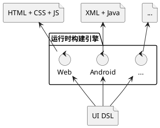
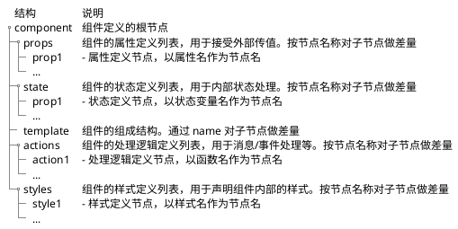

import {Table, TRow, TCol} from '@site/src/components/Table';
import Header from '@site/docs/\_header.md';

<Header />

## 架构设计

本框架所要实现的目标是，对 UI 组件机制进行重新设计和实现，以使其全面支持**差量化**，
最终仅需通过轻量级的**运行时构建引擎**便可将组件的 `UI DSL` 编译为目标运行环境的**运行产物**，
从而保证应用开发的统一性和一致性。



对组件的差量化将不仅仅发生在组件之间，还将涉及到对组件内部，如样式、结构、属性、状态、逻辑等，
各个组成部分的差量化。

不过，对组件编译后的运行产物并不要求是可差量化的，
所以，从 `UI DSL` 到运行产物的转换过程是单向的，不能再由运行产物还原出 `UI DSL`。

> 注意，编译动作也可能会发生在运行环境中，从而可实现热更新/热加载机制。

此外，不同层级的组件均将基于较低层级的组件以**差量叠加**方式构造而成，
而在编译期，则会将高层级组件向下逐级进行差量合并，直到**原子组件**，
所以，**运行时构建引擎**仅需关注如何将原子组件转换为目标运行环境的原生组件即可，
并不需要处理高层级组件的结构和数据。

## 组件设计



- **页面**（`Page`）的本质也是**组件**，其根据**路由**进行加载，并*覆盖整个可视区域*
  - 路由的作用是指示组件的位置，并由**组件加载器**负责加载并激活对应的组件
- 通用组件仅需定义和实现部分内容，比如，处理逻辑、组件内部组成结构等，
  使用方再通过**差量机制**按需补充其他部分即可，以便于实现 **Headless** 模式的
  UI 组件库，并保证所用技术的一致性
- **逻辑组件**可以没有视图，仅用于处理全局数据，比如，全局的 Toast 消息管理组件，
  其仅负责接收和显示 Toast 消息，而消息的样式等则由调用方控制
- 组件间的数据引用包括：
  - 在组件树内**自上而下**的引用：通过 `prop` 单向传递
  - 在不同组件树之间的组件相互的数据引用：通过 `Store` 定义和共享全局变量
- 组件可分为**原子组件**和**复合组件**，前者是不可拆分结构的组件，
  后者则是由一个或多个原子组件或其他复合组件组合而成

  - [聊聊前端 UI 组件：组件特征 - 组件分类](https://ourai.ws/posts/the-features-of-frontend-ui-components/#section-3)

- 在组件定义内可以嵌套定义内部组件，以支持内部复用

```xml
<component>
  <ui:import name="Button" from="button.component.xui" />

  <template>
    <Button />
    <MyButton />
  </template>

  <component name="MyButton" x:extends="button.component.xui">
    ...
  </component>
</component>
```

- 组件样式分类


> 图片来自[《聊聊前端 UI 组件：组件体系》](https://ourai.ws/posts/the-system-of-frontend-ui-components/)。

### 属性 - prop

- `prop` 用于接受外部的变更数据，并沿组件树**自上而下**地进行**单向**变更传递
- `prop` 均为只读的，仅用于传递组件配置，不能直接对其进行变更
  - `input` 的 `value` 存在双向绑定需求，该如何应对？
    - 考虑通过 `Store` 机制，强制与对象绑定，再由对象在组件间传递变更
- 可引用外部定义的数据类型

### 状态 - state

- 全局 `state` 可被组件直接引用，通过 `Store` 机制共享？
- 可引用 `prop` 以初始化其值
- 状态可以是对象类型，可复用 XMeta 的 `prop` 结构做类型定义
- 可引用外部定义的数据类型

### 模板 - template

- 引用其他组件组成其内部结构
- 组件自身不限定其名字，而是在 `import` 时按需指定：`<ui:import name="Button" from="button.component.xui" />`
- 通过节点的 `name` 属性作为节点的定位坐标
- 通过逻辑标签做 `if`（条件）判断和 `each`（循环）处理
  - 逻辑标签仅运行期生效，在编译阶段同样是组件的内部组成结构
  - 直接引用 `state` 和 `props` 为控制变量（**响应式**），从而在运行期动态构造组件结构
  - 需通过 `name` 属性对逻辑标签命名，以支持差量化定制修改
- 可通过 `name` 引用 `action` 逻辑函数，从而作为消息/事件的响应函数

- 可通过 `snippet` 构造**片段组件**，且 `snippet` 为函数式，由组件定义方传入参数并渲染片段组件。
  其类似于传统的 `slot` 机制，但其控制会更加灵活：

```xml title="xxx.page.xui"
<!-- 在页面内全局的 Toast 显示控制 -->
<Toast>
  <ui:snippet name="message">
    <attr name="msg" type="Message" />

    <source>
      <!-- 根据参数 msg 定制消息窗口样式 -->
      <ui:if name="has-msg-title" test="msg.title">
        <Dialog title="${msg.title}" content="${msg.content}" />
      </ui:if>
      <ui:else name="has-not-msg-title">
        <Alert>${msg.content}</Alert>
      </ui:else>
    </source>
  </ui:snippet>
</Toast>
```

```xml title="toast.component.xui"
<component>
  <state>
    <messages type="Message[]" />
  </state>

  <template>
    <ui:each name="travel-messages" for="messages" item="msg" index="i">
      <Block>
        <ui:render name="message" msg="${msg}" />
      </Block>
    </ui:each>
  </template>
</component>
```

- 可引用 `Promise`：

```xml
<component>

  <template>
    <ui:await name="fetch-img" for="fetchImg(${props.name})">
      <before>
        <Alert type="info">Wait a moment ...</Alert>
      </before>
      <then arg="data">
        <Image src="${data.src}" />
      </then>
      <catch arg="err">
        <Alert type="error">${err.message}</Alert>
      </catch>
    </ui:await>
  </template>
</component>
```

- 在组件内通过 `<ui:layout />` 专门控制其内部组成的布局，
  从而避免强制要求内部子节点按布局形式组织节点的嵌套结构，
  进而方便在不同环境中自由定制布局，但无需调整节点的嵌套结构：

```xml title="xxx.component.xui"
<component>

  <template>
    <Form name="login-form">
      <ui:layout>
        <flex>
          <row target="username" />
          <row target="password" />
        </flex>
      </ui:layout>

      <Input name="username" />
      <Input name="password" />
    </Form>
  </template>
</component>
```

- 布局`<ui:layout />` 仅包含元素位置、大小信息，没有样式信息

### 逻辑 - action

- 存在定义和引用公共函数的需求，其要求：函数可导出、函数无状态、逻辑与运行时无关
  - 对于逻辑组件，其需要**导出**相关函数，以便于在其他组件中调用
- 以标签形式定义中间语言，以便于翻译为不同运行环境的执行语言代码？
  - 与运行时相关的函数，仅需提供定义（名称+参数），实现由运行时构建器提供
-
- 由消息/事件触发，比如，点击、定时、HTTP 响应、组件挂载/卸载、state/prop 变更、来自其他组件的消息/事件等
- 在 `action` 内可主动发送消息/事件，在外部则可由父组件监听并处理，也可通过组件的唯一标识由其他组件监听并处理

- 可按顺序调用其他 `action`，与任务编排类似：

```xml
  <actions>
    <action name="call-others">
      <source>
        <verifySomething />
        <fetchSomething />
      </source>
    </action>
  </actions>
```

### 样式 - styles

不可继续拆分其结构的样式，称之为**原子样式**（Atomic Style），比如，边距 `margin` 仅包含上下左右的尺寸信息，
且尺寸不再做结构拆分，故而，其为原子样式，但边框 `border` 可分为上下左右四个部分，
且每个部分均包含尺寸、颜色、样式等信息，因此，`border` 不是原子样式，而是复合形式的，
也即，由一个或多个原子样式或其他复合样式组成的样式，称之为**复合样式**。

也就是，样式的定义结构是**递归**的。原子样式和复合样式的定义结构都是相同的，
因此，在复合样式上也可以定义属性，从而使其具有动态性，比如，定义一个通用的按钮样式 `button`：

```xml
<styles>
  <button size="Size" color="Color">
    <border size="1px" style="solid" color="#aaaaaa" />
    <height value="${size}" />
    <background color="${color}" />
  </button>
</styles>
```

其定义结构包含 `size` 和 `color` 属性，并由复合样式 `border` 和原子样式
`height`、`background` 等组成，而在其子节点中可以直接引用其属性值，
从而可通过 `button` 样式的属性值实现对样式的动态配置，并且与原子样式保持相同形式的引用：

```xml
  <Button name="blue-btn">
    <styles>
      <button size="4em" color="blue" />
    </styles>
  </Button>
  <Button name="green-btn">
    <styles>
      <button size="4em" color="green" />
    </styles>
  </Button>
```

> 注意，不采用规则匹配（如，CSS 选择器）方式向组件应用样式，组件要采用什么样式，
> 就需要显式地引用该样式的名字。

并且，`button` 还可以继续用于定义其他样式：

```xml
<styles>
  <button-gray size="Size">
    <button size="${size}" color="gray" />
  </button-gray>
</styles>
```

因此，可以将原子样式统一定义在基础样式文件中（比如 `base.styles.xui`）：

```xml title="base.styles.xui"
<!-- 定义原子样式 -->
<styles>
  <margin left="Size" right="Size" top="Size" bottom="Size" />
  <font size="Size" family="String" color="Color" />

  <border-base x:abstract="true"
    color="Color" size="Size" style="BorderStyle"
  />
  <border-left x:prototype="border-base" />
  <border-right x:prototype="border-base" />
  <border-top x:prototype="border-base" />
  <border-bottom x:prototype="border-base" />

  <border x:prototype="border-base">
    <border-left color="${color}" size="${size}" style="${style}" />
    <border-right color="${color}" size="${size}" style="${style}" />
    <border-top color="${color}" size="${size}" style="${style}" />
    <border-bottom color="${color}" size="${size}" style="${style}" />
  </border>
</styles>
```

然后，在组件的样式定义标签 `<styles />` 中便可以直接由基础样式组合成新的样式，
并且，组合是可以递归进行的，可以自下而上地组合形成更高层级的样式，正如
[Tailwind](https://tailwindcss.com/) 基于原生样式形成语义化样式，
在应用中则可由 Tailwind 的样式进一步组合形成业务领域的样式。

> 在实现时，可编写工具从 Tailwind 文档中提取并生成语义化的基础样式，原子样式则从 HTML 规范中提取。

不过，样式的定义结构只能嵌套一层，其根节点上负责定义样式名称（也就是标签名）和属性列表（属性名及其类型），
而其子节点只能有一层或者没有任何子节点，子节点代表样式的组成结构，必须明确设置子节点的属性值，
只是子节点的属性值可以直接引用样式的属性值，以实现样式的动态性。

在引用组件时指定的样式将与组件定义的样式做合并，例如，定义了如下结构的 `Button` 组件：

```xml title="button.xui"
<component>
  <template>
    <button>
      <styles> <add-btn /> </styles>
    </button>
  </template>

  <styles>
    <add-btn>
      <font ... />
      <background ... />
      <border ... />
    </add-btn>
  </styles>
</component>
```

则在引用组件时，可以修改组件预置的样式：

```xml title="form.xui"
<component>
  <ui:import name="Button" from="button.xui" />

  <template>
    <Button>
      <styles>
        <!-- 与 button.xui 中 styles 内的同名样式做合并，
        再应用到其内部的 button 组件节点上 -->
        <add-btn> <new-add-btn /> </add-btn>
      </styles>
    </Button>
  </template>

  <styles>
    <new-add-btn>
      <border ... />
    </new-add-btn>
  </styles>
</component>
```

> 注意，`new-add-btn` 也可以与 `Button` 的样式 `add-btn` 同名，
> 且直接以 `<styles><add-btn /></styles>` 形式引用即可，
> 关键是确定 `new-add-btn` 是否可作为当前组件的样式属性。

这就要求，在定义组件内部样式时，需要将每个样式视为组件的**样式属性**（与
[HTML Style Property](https://developer.mozilla.org/en-US/docs/Web/API/HTMLElement/style) 类似），
且每个样式属性仅作用于其某个部分（也可以是一组组成部分），
在引用方修改组件的某个样式，便类似于修改组件的某个属性，
所以，通过样式的名字，便可实现在局部范围内对组件内部的局部样式做定制的需求。

> 在组件内部定义的复合样式需采用**语义化**命名，而不能在名字中暴露与原子样式相关的细节。
> 参考[《HTML & CSS class》](https://ourai.ws/posts/design-frontend-ui-components/#html--css-class)。

### 国际化

- 通过差量机制，直接在组件的 DSL 上做差量实现
  - 运行时构建引擎根据目标语言按照特定的匹配规则查找得到组件的国际化差量定义，
    再对组件 DSL 应用国际化差量，从而得到国际化后的组件
  - 匹配规则可以为 `/_delta/locale/zh_CN/xxx.component.xui` 形式
  - 在国际化文本中可以引用其所在上下文中的可访问变量

### 结构样例

```xml
<component>
  <ui:import name="Table" from="xui:duzhou-ui/table.xui" />

  <props>
    <title type="string" />
  </props>
  <state>
    <title type="string" value="$props.title" />
    <users type="User[]" />
  </state>

  <template>
    <ui:if name="show-title" test="title">
      <Text>{title}</Text>
    </ui:if>
    <Button name="add-new-user" on:click="addNewUser">
      <styles>
        <button color="#0000ff" />
      </styles>
    </Button>
    <ui:each name="travel-users" for="users" item="user" index="i">
      <Table>
        <ui:snippet name="row" args="user">
          <Text>{i}. {user.name}</>
        </ui:snippet>
      </Table>
    </ui:each>
  </template>

  <actions>
    <addNewUser>
      <param name="name" type="String" />

      <source>
        <set var="user" value="{name: ${name}}" />

        <graphql:mutation name="save-user"
          url="/graphql"
          field="NopAuthUser__save"
          data="{user: ${user}}"
          selection="id, name, status"
        >
          <before>
            ...
          </before>
          <then arg="data">
            <set var="state.user" value="data" />
          </then>
          <catch>
            ...
          </catch>
        </graphql:mutation>

        <http:post name="http-post-demo"
          url="https://xxx.xx.xx/xx" />
        <http:get name="http-get-demo"
          url="https://xxx.xx.xx/xx" />
      </source>
    </addNewUser>
  </actions>

  <styles>
    <button color="Color">
      <background color="${color}" />
    </button>
  </styles>
</component>
```

## 运行时构建引擎

### Web 端

- 构建输出 [Svelte](https://svelte.dev/docs/svelte/overview) 框架代码，
  再由其编译器构造 HTML 代码

### Android 端

## 差量包仓库

- 分布式差量包存储仓库，及其包管理器
- 差量包以 `Group ID + Artifact ID + Version` 作为定位坐标
- 按照差量包坐标和包内的差量路径作为引用标识
  - 引用标识不与仓库服务绑定，以便于切换到不同仓库，且支持从多个仓库查找
  - 引用标识最终需绑定差量包的 HASH 值，并在合并时做校验，
    从而保证差量包不被篡改
- 本地缓存差量包，避免重复下载

## 参考资料

- [说说「反混沌」：Fxxk Design](https://ourai.ws/posts/fxxk-design-from-anti-chaos/):
  【它们的设计在我看来大多不够「原子」，不够「纯粹」——如 `Input` 组件把实质上不是同一个东西的通过
  `type` 属性去控制具体的展示形态；如 `Button` 组件拥有值为 `primary`、`text` 等的
  `type` 这种与其自然特性毫无关联的属性】
- [聊聊前端 UI 组件](https://ourai.ws/series/talking-about-frontend-ui-components/)
- [Petals UI - 控件设计指南](https://petals-ui.github.io/guides/control-design/):
  【在[基于组件开发](https://en.wikipedia.org/wiki/Component-based_software_engineering)（Component-based Development）的体系中，
  HTML & CSS class应当是足够语义化的，让人在视图结构中一眼看到后就知道它是个什么东西，而不是长什么样】
-
- [Svelte Snippets](https://svelte.dev/docs/svelte/snippet)
- [Svelte Await](https://svelte.dev/docs/svelte/await)
