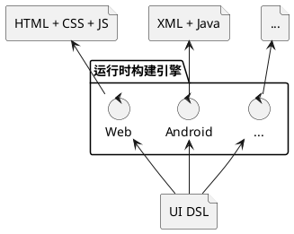
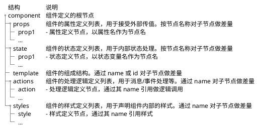

import {Table, TRow, TCol} from '@site/src/components/Table';
import Header from '@site/docs/\_header.md';

<Header />

## 架构设计

本框架所要实现的目标是，对 UI 组件机制进行重新设计和实现，以使其全面支持**差量化**，
最终仅需通过轻量级的**运行时构建引擎**便可将组件的 `UI DSL` 编译为目标运行环境的**运行产物**，
从而保证应用开发的统一性和一致性。



对组件的差量化将不仅仅发生在组件之间，还将涉及到对组件内部，如样式、结构、属性、状态、逻辑等，
各个组成部分的差量化。

不过，对组件编译后的运行产物并不要求是可差量化的，
所以，从 `UI DSL` 到运行产物的转换过程是单向的，不能再由运行产物还原出 `UI DSL`。

> 注意，编译动作也可能会发生在运行环境中，从而可实现热更新/热加载机制。

此外，不同层级的组件均将基于较低层级的组件以**差量叠加**方式构造而成，
而在编译期，则会将高层级组件向下逐级进行差量合并，直到**原子组件**，
所以，**运行时构建引擎**仅需关注如何将原子组件转换为目标运行环境的原生组件即可，
并不需要处理高层级组件的结构和数据。

## 组件设计



- **页面**（`Page`）的本质也是**组件**，其根据**路由**进行加载，并*覆盖整个可视区域*
  - 路由的作用是指示组件的位置，并由**组件加载器**负责加载并激活对应的组件
- 通用组件仅需定义和实现部分内容，比如，处理逻辑、组件内部组成结构等，
  使用方再通过**差量机制**按需补充其他部分即可，以便于实现 **Headless** 模式的
  UI 组件库，并保证所用技术的一致性
- **逻辑组件**可以没有视图，仅用于处理全局数据，比如，全局的 Toast 消息管理组件，
  其仅负责接收和显示 Toast 消息，而消息的样式等则由调用方控制
- 组件间的数据引用包括：
  - 在组件树内**自上而下**的引用：通过 `prop` 单向传递
  - 在不同组件树之间的组件相互的数据引用：通过 `Store` 定义和共享全局变量
- 组件自身不限定其名字，而由其他组件在 `import` 时按需指定

### 属性 - prop

- `prop` 用于接受外部的变更数据，并沿组件树**自上而下**地进行**单向**变更传递
-

### 状态 - state

- 全局 `state` 可被组件直接引用，通过 `Store` 机制共享？
- 可引用 `prop` 以初始化其值

### 模板 - template

- 引用其他组件组成其内部结构
- 通过逻辑标签做 `if`（条件）判断和 `each`（循环）处理
  - 逻辑标签仅运行期生效，在编译阶段同样是组件的内部组成结构
  - 直接引用 `state` 和 `props` 为控制变量（**响应式**），从而在运行期动态构造组件结构
  - 需通过 `name` 属性对逻辑标签命名，以支持差量化定制修改
- 可通过 `name` 引用 `action` 逻辑函数，从而作为消息/事件的响应函数

- 可通过 `snippet` 构造**片段组件**，且 `snippet` 为函数式，由组件定义方传入参数并渲染片段组件。
  其类似于传统的 `slot` 机制，但其控制会更加灵活。以**运行时**的 Svelte 组件为例：

```xml title="CallToast.svelte"
<Toast>
  {#snippet message(msg)}
    <!-- 根据参数 msg 定制消息窗口样式 -->
    {#if msg.title}
      <title>{msg.title}</title>
      <div>...</div>
    {:else}
      ...
    {/if}
  {/snippet}
</Toast>
```

```xml title="Toast.svelte"
<script>let {message} = $props();</script>
<!-- 向 snippet 传入参数，并渲染消息窗口 -->
<div>{ @render message({title: 'Hello, world!', ...}) }</div>
```

- 可引用 `Promise`。以**运行时**的 Svelte 组件为例：

```xml
{#await fetchImg($props.name)}
  <p>Wait a moment ...</p>
{:then data}
  
{:catch err}
  <p>{err.message}</p>
{/await}
```

### 逻辑 - action

- 存在定义和引用公共函数的需求，其要求：函数可导出、函数无状态、逻辑与运行时无关
  - 对于逻辑组件，其需要**导出**相关函数，以便于在其他组件中调用
-
- 由消息/事件触发，比如，点击、定时、HTTP 响应、组件挂载/卸载、state/prop 变更、来自其他组件的消息/事件等
- 在 `action` 内可主动发送消息/事件，在外部则可由父组件监听并处理，也可通过组件的唯一标识由其他组件监听并处理
- 以标签形式定义中间语言，以便于翻译为不同运行环境的执行语言代码？

### 样式 - style

- 不支持 CSS 选择器，在 `template` 中的组件要应用什么样式，均需要显式引用样式的名字
- 样式可带参数，从而实现对**动态样式**的支持，同时，也与原子样式的定义形式保持一致，
  实现样式的**无差别**的嵌套引用

- 在 CSS 中的 `margin`、`border`、`font` 等为**原子样式**，其以 `<styles/>` 形式定义：

```xml title="base.styles.xui"
<!-- 定义原子样式 -->
<styles>
  <margin left="Size" right="Size" top="Size" bottom="Size" />
  <font size="Size" family="String" color="Color" />

  <border-left color="Color" size="Size" style="BorderStyle" />
  <border-right color="Color" size="Size" style="BorderStyle" />
  <border-top color="Color" size="Size" style="BorderStyle" />
  <border-bottom color="Color" size="Size" style="BorderStyle" />

  <border color="Color" size="Size" style="BorderStyle">
    <border-left color="{color}" size="{size}" style="{style}" />
    <border-right color="{color}" size="{size}" style="{style}" />
    <border-top color="{color}" size="{size}" style="{style}" />
    <border-bottom color="{color}" size="{size}" style="{style}" />
  </border>
</styles>
```

- 在组件的 `<styles/>` 中定义的是**高阶样式**，其与 `font`、`background`、`margin`
  等**原子样式**没有本质区别，其同样可以定义动态参数，在组件内引用时，
  可通过节点属性传递该动态参数，从而与原子样式的引用形式一致：

```xml title="some-buttons.xui"
  <template>
    <Button name="btn-add">
      <styles>
        <button size="5em" color="green" />
      </styles>
    </Button>
    <Button name="btn-del">
      <styles>
        <button size="5em" />
      </styles>
    </Button>
  </template>

  <styles>
    <button size="Size=4em" color="Color=red">
      <font size="2em" color="{color}" />
      <height value="{size}" />
    </button>
  </styles>
```

- 带参数的高阶样式同样可以被嵌套使用，并且可预设一些参数，以定义新的样式：

```xml
  <styles>
    <button-gray size="Size">
      <button size="{size}" color="gray" />
    </button-gray>
  </styles>
```

- 可以预置 [Tailwind 4](https://tailwindcss.com/) 的样式，从而统一风格
  - 编写工具对其做批量转换生成

### 结构样例

```xml
<component>
  <ui:import name="Table" from="xui:duzhou-ui/table.xui" />

  <props>
    <title type="string" />
  </props>
  <state>
    <title type="string" value="$props.title" />
    <users type="User[]" />
  </state>

  <template>
    <ui:if name="show-title" cond="title">
      <Text>{title}</Text>
    </ui:if>
    <Button name="add-new-user" on:click="addNewUser">
      <styles>
        <button color="#0000ff" />
      </styles>
    </Button>
    <ui:each name="travel-users" for="users" item="user" index="i">
      <Table>
        <ui:snippet name="row" args="user">
          <Text>{i}. {user.name}</>
        </ui:snippet>
      </Table>
    </ui:each>
  </template>

  <actions>
    <action name="addNewUser" lang="typescript">
    </action>
  </actions>

  <styles>
    <button color="Color">
      <background color="{color}" />
    </button>
  </styles>
</component>
```

## 运行时构建引擎

### Web 端

- 构建输出 [Svelte](https://svelte.dev/docs/svelte/overview) 框架代码，
  再由其编译器构造 HTML 代码

### Android 端

## 差量包仓库

- 分布式差量包存储仓库，及其包管理器
- 差量包以 `Group ID + Artifact ID + Version` 作为定位坐标
- 按照差量包坐标和包内的差量路径作为引用标识
  - 引用标识不与仓库服务绑定，以便于切换到不同仓库，且支持从多个仓库查找
  - 引用标识最终需绑定差量包的 HASH 值，并在合并时做校验，
    从而保证差量包不被篡改
- 本地缓存差量包，避免重复下载
