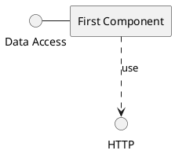
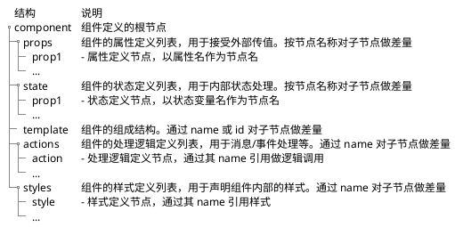

import {Table, TRow, TCol} from '@site/src/components/Table';
import Header from '@site/docs/\_header.md';

<Header />



- 本框架所要实现的是，更高层级的组件定义和处理引擎，与运行时无关，但可通过差量和形式转换实现对不同运行时代码的构建支持，
  从而以一套逻辑实现多端、多环境运行
- 整理不同运行时的组件，抽取出公共组件，作为 `Duzhou UI` 的基础组件，再由这些基础组件逐步搭建起高阶组件

## 组件设计



- **页面**的本质也是**组件**，其根据**路由**进行加载，并*覆盖整个可视区域*
  - 路由的作用是指示组件的位置，并由**组件加载器**负责加载并激活对应的组件
- 通用组件仅需定义和实现部分内容，比如，处理逻辑、组件内部组成结构等，
  使用方再通过**差量机制**按需补充其他部分即可，以便于实现 **Headless** 模式的
  UI 组件库，并保证所用技术的一致性
- **逻辑组件**可以没有视图，仅用于处理全局数据，比如，全局的 Toast 消息管理组件，
  其仅负责接收和显示 Toast 消息，而消息的样式等则由调用方控制
- 组件间的数据引用包括：
  - 在组件树内**自上而下**的引用：通过 `prop` 单向传递
  - 在不同组件树之间的组件相互的数据引用：通过 `Store` 定义和共享全局变量
- 组件自身不限定其名字，而由其他组件在 `import` 时按需指定

### 属性 - prop

- `prop` 用于接受外部的变更数据，并沿组件树**自上而下**地进行**单向**变更传递
-

### 状态 - state

- 全局 `state` 可被组件直接引用，通过 `Store` 机制共享？
-

### 模板 - template

- 引用其他组件组成其内部结构
- 通过逻辑标签做 `if`（条件）判断和 `each`（循环）处理
  - 逻辑标签仅运行期生效，在编译阶段同样是组件的内部组成结构
  - 直接引用 `state` 和 `props` 为控制变量（**响应式**），从而在运行期动态构造组件结构
  - 需通过 `name` 属性对逻辑标签命名，以支持差量化定制修改
- 可通过 `name` 引用 `action` 逻辑函数，从而作为消息/事件的响应函数

- 可通过 `snippet` 构造**片段组件**，且 `snippet` 为函数式，由组件定义方传入参数并渲染片段组件。
  其类似于传统的 `slot` 机制，但其控制会更加灵活。以**运行时**的 Svelte 组件为例：

```xml title="CallToast.svelte"
<Toast>
  {#snippet message(msg)}
    <!-- 根据参数 msg 定制消息窗口样式 -->
    {#if msg.title}
      <title>{msg.title}</title>
      <div>...</div>
    {:else}
      ...
    {/if}
  {/snippet}
</Toast>
```

```xml title="Toast.svelte"
<script>let {message} = $props();</script>
<!-- 向 snippet 传入参数，并渲染消息窗口 -->
<div>{ @render message({title: 'Hello, world!', ...}) }</div>
```

- 可引用 `Promise`。以**运行时**的 Svelte 组件为例：

```xml
{#await fetchImg($props.name)}
  <p>Wait a moment ...</p>
{:then data}
  
{:catch err}
  <p>{err.message}</p>
{/await}
```

### 逻辑 - action

- 存在定义和引用公共函数的需求，其要求：函数可导出、函数无状态、逻辑与运行时无关
  - 对于逻辑组件，其需要**导出**相关函数，以便于在其他组件中调用
-
- 由消息/事件触发，比如，点击、定时、HTTP 响应、组件挂载/卸载、state/prop 变更、来自其他组件的消息/事件等
- 在 `action` 内可主动发送消息/事件，在外部则可由父组件监听并处理，也可通过组件的唯一标识由其他组件监听并处理

### 样式 - style

- 可直接引用 `state` 变量，且为响应式？
-

### 定义样例

```xml
<component>
  <ui:import name="Table" from="xui:duzhou-ui/table.xui" />

  <props>
    <title type="string" />
  </props>
  <state>
    <title type="string" value="$props.title" />
    <users type="User[]" />
  </state>

  <template>
    <ui:if name="show-title" cond="title">
      <Text>{title}</Text>
    </ui:if>
    <Button name="add-new-user" on:click="addNewUser"></Button>
    <ui:each name="each-users" for="users" item="user" index="i">
      <Table>
        <ui:snippet name="row" args="user">
          <Text>{i}. {user.name}</>
        </ui:snippet>
      </Table>
    </ui:each>
  </template>

  <actions>
    <action name="addNewUser" lang="typescript">
    </action>
  </actions>

  <styles>
    <style name="root">
      <font size="10px" family="YaHei" />
    </style>
  </styles>
</component>
```
