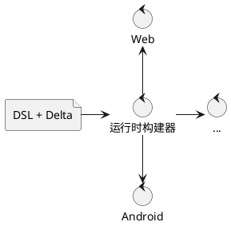
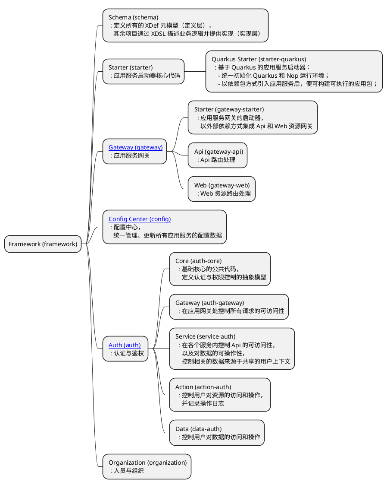

import DocCardList from '@theme/DocCardList';

## 核心设计

以 DSL 描述和表达业务结构与业务逻辑，各层仅关注自身业务的完整表达，层与层之间通过
DSL 形式变换实现数据转换，最终，由运行时构建器完成运行时产物的编译和输出：

## 模块结构

<!-- https://plantuml.com/mindmap-diagram -->

> Maven 工程模块目录添加数字前缀以控制目录顺序，
> 模块目录按重要性排序。

## 章节目录

<DocCardList />
