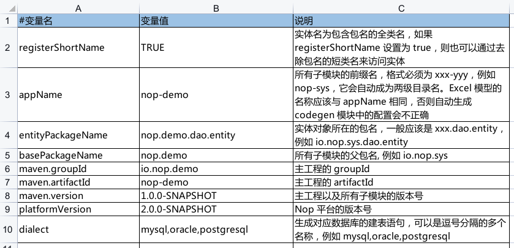

import Header from '../../../\_header.md';

<Header />

## 准备工作

按照[本地开发](../#本地开发)要求对 NOP
平台的工程代码进行本地构建并发布到本地 Maven 仓库中。

然后，将 `nop-cli/target/nop-cli-2.0.0-BETA.1.jar`
复制到当前的工程目录（此时还是空目录）中，并将其重命名为 `nop-cli.jar`：

```bash
export NOP_HOME=/path/to/nop/dir

cp ${NOP_HOME}/nop-cli/target/nop-cli-2.0.0-BETA.1.jar ./nop-cli.jar
```

## 创建空白工程

### 工程配置

将 [Excel 模板](./files/nop-demo.orm.xlsx)下载到工程目录下的
`model` 子目录中（实际可放在任意目录，这里仅是为了方便管理和后续维护），
并在 Excel 中的【配置】表单中填写本案例的 Maven 工程模块名和包名等信息（暂时忽略其他表单）：



> 详细的工程配置说明请见 [Excel 数据模型#配置](https://gitee.com/canonical-entropy/nop-entropy/blob/master/docs/dev-guide/model/excel-model.md#%E9%85%8D%E7%BD%AE)。

### 工程初始化

```bash
export JAVA_HOME=/usr/lib/jvm/java-17-openjdk

${JAVA_HOME}/bin/java \
  -jar ./nop-cli.jar \
  gen ./model/nop-demo.orm.xlsx \
  -t=/nop/templates/orm
```

> 通过 `${JAVA_HOME}/bin/java -jar ./nop-cli.jar gen -h `
> 可查看 `gen` 子命令的详细参数说明。

### 工程构建

```bash
export JAVA_HOME=/usr/lib/jvm/java-17-openjdk

# Note：若为首次执行需去掉选项 -o，以下载必要的构建依赖包
mvn clean package -o -DskipTests -Dquarkus.package.type=uber-jar
```

自动生成的工程目录结构如下：

```
├─ nop-demo-api       对外暴露的接口定义和消息定义
├─ nop-demo-codegen   代码生成辅助工程，根据 ORM 模型更新当前工程代码
├─ nop-demo-dao       数据库实体定义和 ORM 模型
├─ nop-demo-service   GraphQL 服务实现
├─ nop-demo-web       AMIS 页面文件以及 View 模型定义
├─ nop-demo-app       测试使用的打包工程
├─ deploy             根据 Excel 模型生成的数据库建表语句
├─ nop-demo-meta
├─ src
```

### 工程服务启动

```bash
export JAVA_HOME=/usr/lib/jvm/java-17-openjdk

${JAVA_HOME}/bin/java \
  -Dfile.encoding=UTF8 \
  -Dquarkus.profile=dev \
  -jar ./nop-demo-app/target/nop-demo-app-1.0.0-SNAPSHOT-runner.jar
```

## 参考资料

- [NOP 开发示例](https://gitee.com/canonical-entropy/nop-entropy/blob/master/docs/tutorial/tutorial.md)
- [NOP Excel 数据模型介绍](https://gitee.com/canonical-entropy/nop-entropy/blob/master/docs/dev-guide/model/excel-model.md)
