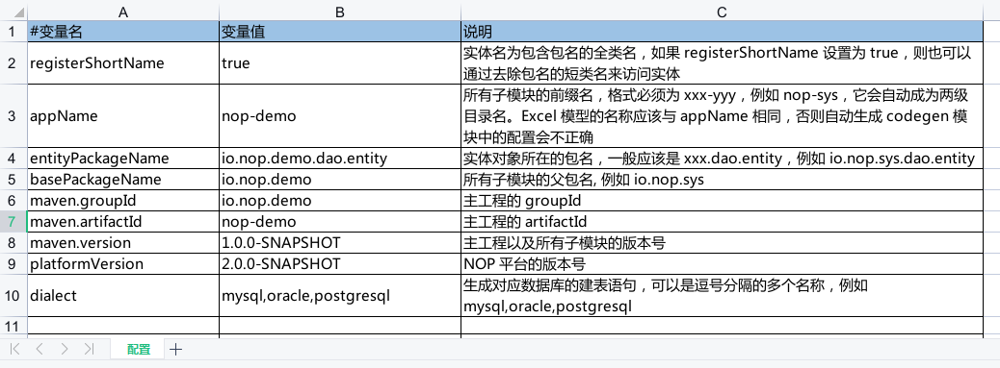
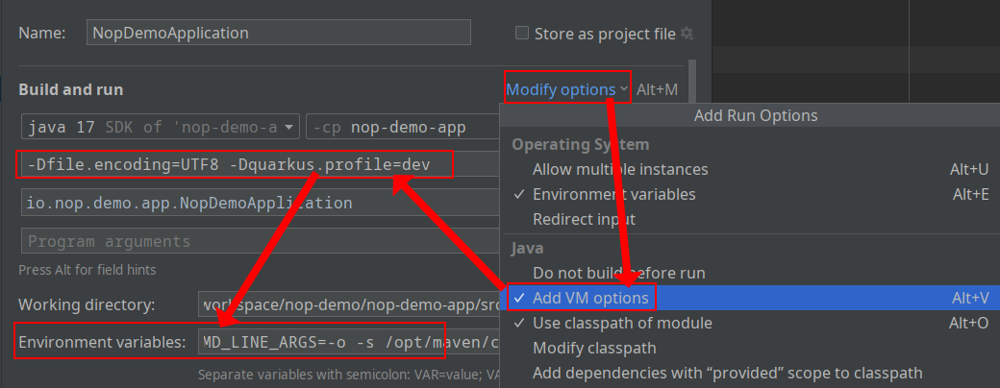

import Header from '../../../\_header.md';

<Header />

## 准备工作

按照[本地开发](../#本地开发)要求对 NOP
平台的工程代码进行本地构建并发布到本地 Maven 仓库中。

创建本案例的工程目录 `nop-demo`，
并将 `nop-cli/target/nop-cli-2.0.0-BETA.1.jar`
复制到工程目录（此时还是空目录）中：

```bash
export NOP_HOME=/path/to/nop/dir

cp "${NOP_HOME}/nop-cli/target/nop-cli-2.0.0-BETA.1.jar" ./nop-cli.jar
```

## 创建空白工程

### 工程配置

下载 [nop-demo.orm.v0.xlsx](./files/v0/nop-demo.orm.v0.xlsx) 并将其放到工程目录下的
`model/` 子目录中，并重命名为 `nop-demo.orm.xlsx`，
然后，在该 Excel 中的【配置】表单中填写本案例的 Maven 工程模块名和包名等信息：



> 详细的工程配置说明请见 [Excel 数据模型#配置](https://gitee.com/canonical-entropy/nop-entropy/blob/master/docs/dev-guide/model/excel-model.md#%E9%85%8D%E7%BD%AE)。

### 工程初始化

```bash
export JAVA_HOME=/usr/lib/jvm/java-17-openjdk

${JAVA_HOME}/bin/java \
  -Dfile.encoding=UTF8 \
  -jar ./nop-cli.jar \
  gen -t=/nop/templates/orm \
  ./model/nop-demo.orm.xlsx
```

> 通过 `${JAVA_HOME}/bin/java -jar ./nop-cli.jar gen -h`
> 可查看 `gen` 子命令的详细参数说明。
> 其中，`-t` 选项所指向的是 NOP 工程中
> `nop-codegen/src/main/resources/_vfs/nop/templates/orm`
> 目录下的模板，`gen` 命令所生成的工程目录结构与该模板是一致的。

### 工程构建

```bash
export JAVA_HOME=/usr/lib/jvm/java-17-openjdk

# Note：若为首次执行需去掉选项 -o，以下载必要的构建依赖包
mvn clean package -o -DskipTests -Dquarkus.package.type=uber-jar
```

> 后续更新 Excel 数据模型文件，需要重新构建
> `mvn package -o -DskipTests -Dquarkus.package.type=uber-jar`。

自动生成的工程目录结构如下：

```
├─ nop-demo-api       对外暴露的接口定义和消息定义
├─ nop-demo-codegen   代码生成辅助工程，根据 ORM 模型更新当前工程代码
├─ nop-demo-dao       数据库实体定义和 ORM 模型
├─ nop-demo-service   GraphQL 服务实现
├─ nop-demo-web       AMIS 页面文件以及 View 模型定义
├─ nop-demo-app       测试使用的打包工程
├─ nop-demo-meta
├─ deploy             根据 Excel 模型生成的数据库建表语句
├─ src
├─ _dump              所有编译期合成的模型，其中会打印每个节点和属性的来源源码位置
```

### 工程服务启动

```bash
export JAVA_HOME=/usr/lib/jvm/java-17-openjdk

${JAVA_HOME}/bin/java \
  -Dfile.encoding=UTF8 \
  -Dquarkus.profile=dev \
  -jar ./nop-demo-app/target/nop-demo-app-1.0.0-SNAPSHOT-runner.jar
```

注意，在通过 IDE 做开发调试时，需要以调试模式启动 `io.nop.demo.app.NopDemoApplication#main`，
并且需在启动配置中添加 VM 参数 `-Dfile.encoding=UTF8 -Dquarkus.profile=dev`，
同时设置环境变量为 `MAVEN_CMD_LINE_ARGS=-o -s /path/to/maven/settings.xml`
以设置 Maven 的命令行参数：



> - `io.quarkus.runtime.Quarkus#run` 会自动调用 Maven 下载
>   `NopDemoApplication` 的项目依赖，其使用的是 Maven 默认配置，
>   与 IDE 的 Maven 配置无关，所以，需通过环境变量
>   `MAVEN_CMD_LINE_ARGS`（注意，多个环境变量是以 `;` 分隔的，所以，含空格的变量值不能加引号）
>   向 Quarkus 内置的 Maven 传递参数，然后，在参数中指定配置文件位置（`-s`）并启用离线模式（`-o`）；
> - 若是要调试构建逻辑，则调试启动 `io.nop.demo.codegen.NopDemoCodeGen#main`
>   或 `io.nop.demo.web.NopDemoWebCodeGen#main` 即可；

## 注意事项

- Excel 数据模型文件默认需放在 `model` 目录下，且其名称必须为 `${appName}.orm.xlsx`，
  因为在 NOP 内置的模板
  `nop-entropy/nop-codegen/src/main/resources/_vfs/nop/templates/orm/{appName}-codegen/postcompile/gen-orm.xgen.xgen`
  中固定了 Excel 数据模型的读取位置为
  `model/${moduleName}.orm.xlsx`（其不影响初始化，但在后续 Maven 打包构建时需要读取），
  而 `moduleName` 默认是与 `appName` 相同的（在
  `nop-entropy/nop-codegen/src/main/resources/_vfs/nop/codegen/xlib/gen.xlib`
  中的 `<DefineLoopForOrm/>` 节点下有详细的处理逻辑）；
- `appName` 中的 `-` 将被替换为 `/` 后作为虚拟文件系统的顶级子目录，
  如，`src/main/resources/_vfs/nop/demo` 中的 `nop/demo` 便是按此规则确定的，
  但是 NOP 限制该目录层级只能为两级，以便于控制模块扫描的范围，故而，在 `appName` 中只能有一个 `-`；
- 在指定了应用的配置参数 `nop.orm.init-database-schema` 为 `true` 后，
  NOP 将通过 `DatabaseSchemaInitializer` 自动创建数据库表

## 参考资料

- [NOP 开发示例](https://gitee.com/canonical-entropy/nop-entropy/blob/master/docs/tutorial/tutorial.md)
- [NOP Excel 数据模型介绍](https://gitee.com/canonical-entropy/nop-entropy/blob/master/docs/dev-guide/model/excel-model.md)
