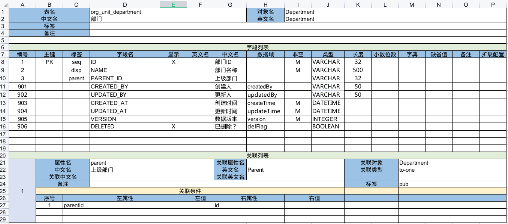

import Header from '../../../\_header.md';

<Header />

第一版将实现对 `Department`、`Region`、`JobTitle` 和 `Employee` 基本信息的增删改，
以及对关联关系的绑定。

下载 [nop-demo.orm.v1.xlsx](./files/nop-demo.orm.v1.xlsx) 并覆盖工程目录下的
`model/nop-demo.orm.xlsx` 文件，再通过 `nop-cli gen` 生成模型和前端页面：

```bash
export JAVA_HOME=/usr/lib/jvm/java-17-openjdk

${JAVA_HOME}/bin/java \
  -Dfile.encoding=UTF8 \
  -jar ./nop-cli.jar \
  gen -t=/nop/templates/orm \
  ./model/nop-demo.orm.xlsx
```

## 模型定义

完整的 Excel 数据模型结构见
[nop-orm-model/src/main/resources/\_vfs/nop/orm/imp/orm.imp.xml](https://gitee.com/canonical-entropy/nop-entropy/blob/master/nop-orm-model/src/main/resources/_vfs/nop/orm/imp/orm.imp.xml)，
并阅读文档 [Excel 数据模型](https://gitee.com/canonical-entropy/nop-entropy/blob/master/docs/dev-guide/model/excel-model.md)。



定义 Excel 数据模型需注意以下几点：

- 所有的实体模型都必须定义一个【主键】（值为 `PK`）以及一个在前端的显示名称（【标签】包含 `disp` 的字段），
  若不指定 `disp` 字段，则默认以主键列的值作为显示内容
- 【标签】包含 `seq` 的 `VARCHAR` 类型的字段将默认使用 UUID 值，其字符串长度为 `32`
- 【标签】包含 `parent` 的字段代表该对象的父级属性，在前端维护对象的父子关系时将能够自动识别并正确赋值，
  比如，在列表【操作】列点击【更多】下拉菜单中的【添加下级】时，将会在编辑框中自动设置新数据的父对象为当前行数据
- 【字段列表】中的【编号】必须是唯一的，不能重复，其将被作为属性标识用于识别 Delta 变更，
  且其大小顺序即为各字段在前端列表中的默认显示顺序
- 关联字段 `PARENT_ID` 在前端将实际显示为被关联对象的 `disp` 字段值，
  因此，需将该字段视为被关联对象，在 【中文名】或【英文名】中不能再包含 `ID` 之类的名称
- 【关联列表】中的【属性名】为必填项，其内容为当前对象与被关联对象绑定时的属性名称，
  【关联条件】中的【左属性】与【右属性】分别为当前对象和被关联对象在数据库层面做 join
  的字段所映射的对象属性名称，数据库字段均需与对象的属性做映射，
  并按照驼峰命名规则建立自动映射
- 【数据域】为 `version` 的字段为后端维护数据，默认在前端不显示，在 Excel 中无法开启显示。
  注：内置的数据域在 `nop-orm-model/src/main/resources/_vfs/nop/orm/imp/orm.imp.xml` 中识别
- 表单 `org_staff_employee` 将采用自定义属性 `fullName` 做显示属性，
  故而，未在【字段列表】中标记 `disp` 字段


## 前端自定义

> 以下划线开头的文件为 `nop-cli gen` 自动生成的，做自定义修改需修改对应的去掉开头下划线的同名文件。

### 修改一级菜单名称

```xml title="nop-demo-web/src/main/resources/_vfs/nop/demo/auth/nop-demo.action-auth.xml"
<?xml version="1.0" encoding="UTF-8" ?>
<auth x:extends="_nop-demo.action-auth.xml"
      x:schema="/nop/schema/action-auth.xdef"
      xmlns:x="/nop/schema/xdsl.xdef">

    <site id="main">
        <resource id="test-orm-nop-demo" displayName="组织管理">
            <children/>
        </resource>
    </site>
</auth>
```

### 调整二级菜单项顺序

```xml title="nop-demo-web/src/main/resources/_vfs/nop/demo/auth/nop-demo.action-auth.xml"
    <site id="main">
        <resource id="test-orm-nop-demo" displayName="组织管理">
            <children>
                <resource id="Employee-main" orderNo="10000"/>
                <resource id="Region-main" orderNo="10010"/>
                <resource id="Department-main" orderNo="10020"/>
                <resource id="JobTitle-main" orderNo="10030"/>
            </children>
        </resource>
    </site>
```

### 合并员工姓名

```xml title="nop-demo-meta/src/main/resources/_vfs/nop/demo/model/Employee/Employee.xmeta"
<?xml version="1.0" encoding="UTF-8" ?>
<meta x:schema="/nop/schema/xmeta.xdef"
      xmlns:x="/nop/schema/xdsl.xdef"
      x:extends="_Employee.xmeta">

    <!-- 前端显示属性修改为 fullName -->
    <displayProp>fullName</displayProp>

    <props>
        <!-- 新增计算属性 fullName -->
        <prop name="fullName" displayName="姓名">
            <getter>
                entity.lastName + entity.firstName
            </getter>
        </prop>
    </props>
</meta>
```

```xml title="nop-demo-web/src/main/resources/_vfs/nop/demo/pages/Employee/Employee.view.xml"
<?xml version="1.0" encoding="UTF-8" ?>
<view x:extends="_gen/_Employee.view.xml"
      x:schema="/nop/schema/xui/xview.xdef"
      xmlns:x="/nop/schema/xdsl.xdef">

    <!-- Note：未做定制修改的节点需保留占位 -->
    <grids>
        <grid id="list">
            <cols>
                <!-- 移除 姓/名 列 -->
                <col id="firstName" x:override="remove"/>
                <col id="lastName" x:override="remove"/>
                <!-- 增加 姓名 列 -->
                <col id="fullName"/>
            </cols>
        </grid>
        <grid id="pick-list"/>
    </grids>

    <forms>
        <form id="view">
            <!-- 查看表单只显示 fullName -->
            <layout>
                fullName[姓名]
                regionId[区域]
                departmentId[部门]
                jobTitleId[职位]
                createdBy[创建人]
                updatedBy[更新人]
                createdAt[创建时间]
                updatedAt[更新时间]
            </layout>
        </form>
        <form id="edit">
            <!-- 编辑表单在一行内显示姓与名 -->
            <layout>
                lastName[姓] firstName[名]
                regionId[区域]
                departmentId[部门]
                jobTitleId[职位]
            </layout>
        </form>
    </forms>

    <pages>
        <crud name="main"/>
        <picker name="picker"/>
    </pages>
</view>
```

## 参考资料

- [Excel 数据模型](https://gitee.com/canonical-entropy/nop-entropy/blob/master/docs/dev-guide/model/excel-model.md)
