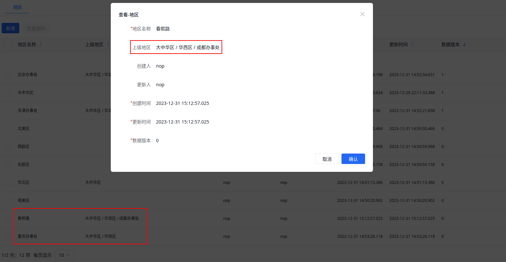
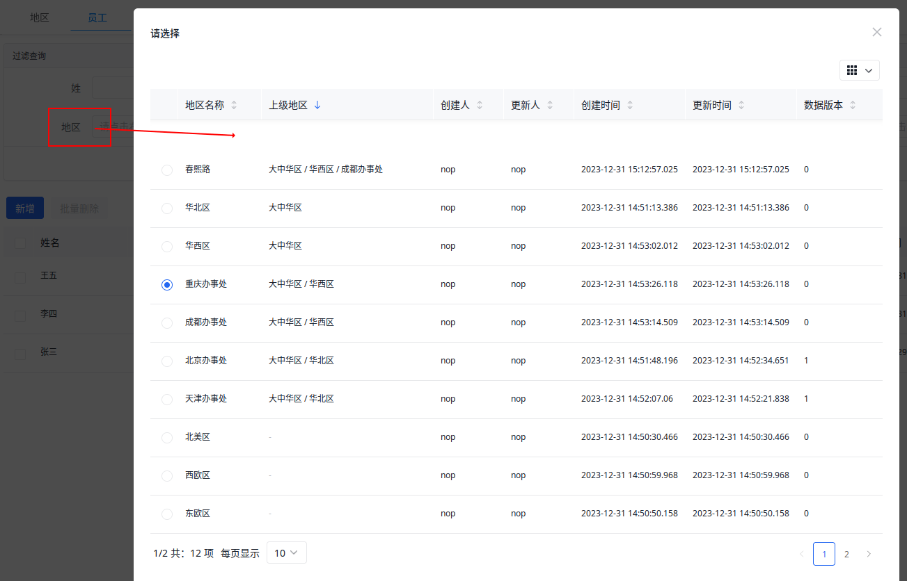

import Header from '../../../\_header.md';

<Header />

这一版将实现对 `Employee` 的条件查询，并抽取模型的基础 DSL。

下载 [nop-demo.orm.v2.xlsx](./files/nop-demo.orm.v2.xlsx) 并覆盖工程目录下的
`model/nop-demo.orm.xlsx` 文件，再通过 `nop-cli gen` 生成模型和前端页面：

```bash
export JAVA_HOME=/usr/lib/jvm/java-17-openjdk

${JAVA_HOME}/bin/java \
  -Dfile.encoding=UTF8 \
  -jar ./nop-cli.jar \
  gen -t=/nop/templates/orm \
  ./model/nop-demo.orm.xlsx
```

- 可用的控件见 Nop 平台中的 `nop-web/src/main/resources/_vfs/nop/web/xlib/control.xlib`

## 地区列表左侧添加导航树

- 以 `@:` 为前缀的值按照 json 格式解析

## 员工列表上部添加过滤查询

## 沿父级显示全部父节点名称



该定制涉及以下方面：

- 在 GraphQL Selection 中需设置获取足够的嵌套层级的 `parent{name}`
  - GraphQL 不支持递归嵌套，只能显式嵌套多级层级结构
- `parent` 的显示组件上需沿 `parent` 路径获取全部父节点名称后，再拼接在一起显示，
  但仅显示内容按此变化，隐射的 `parent.id` 依然为直接父节点

也就是，需对 GraphQL 请求参数进行修改，并重新组装返回结果。

Nop 平台所使用的 AMIS 框架支持对
[API 请求](https://baidu.github.io/amis/zh-CN/docs/types/api)
进行前处理（`requestAdaptor`）和后处理（`adaptor`），
因此，可以在这两处位置实现相应的定制化处理。

由于地区和部门的前端页面都需进行相同的改造，所以，
针对 `<api/>` 的定制化修改需提取到一个 Xpl 库中，以便于复用该类修改：

```xml title="nop-demo-delta/src/main/resources/_vfs/_delta/v2/nop/demo/pages/nested.xlib"
<?xml version="1.0" encoding="UTF-8" ?>
<lib xmlns:x="/nop/schema/xdsl.xdef" x:schema="/nop/schema/xlib.xdef">
  <tags>
    <!-- AMIS 采用的是 json 格式数据，故需设置 Xpl 函数的输出为 xjson -->
    <GridListApi outputMode="xjson">
      <!-- 声明必须传递的参数 bizObjName，以指定业务模型名称 -->
      <attr name="bizObjName" mandatory="true"/>

      <source>
        <!--
        any 标签会与调用 x:gen-extends 标签的父节点合并，
        所以，这里的标签名没有意义，只是用于确保其子节点能够合并为目标节点的子节点
        -->
        <any>
          <api url="@query:${bizObjName}__findPage" gql:selection="{@pageSelection}">
            <!-- 调用当前库（thisLib）的函数 ApiRequestAdaptor -->
            <thisLib:ApiRequestAdaptor/>
            <adaptor><![CDATA[
              const mutate = (item) => {
                // 组装层级数据
              };
              payload.data.items.forEach(mutate);

              return payload;
            ]]></adaptor>
          </api>
        </any>
      </source>
    </GridListApi>

    <!-- 对查看页面的定制支持 -->
    <GetInitApi outputMode="xjson">
      <attr name="bizObjName" mandatory="true"/>

      <source>
        <any>
          <initApi url="@query:${bizObjName}__get?id=$id" gql:selection="{@formSelection}">
            <thisLib:ApiRequestAdaptor/>
            <adaptor><![CDATA[
              const mutate = (item) => {
                // 组装层级数据
              };
              mutate(payload.data);

              return payload;
            ]]></adaptor>
          </initApi>
        </any>
      </source>
    </GetInitApi>

    <ApiRequestAdaptor outputMode="xjson">
      <source>
        <!-- 以字符串替换方式，将请求中的 gql:selection 进行修改 -->
        <requestAdaptor><![CDATA[
          const selection = api['gql:selection'];
          api['gql:selection'] =
            selection.replaceAll(
              'parent{name}',
              'parent{name,parent{name}}'
            );

          return api;
        ]]></requestAdaptor>
      </source>
    </ApiRequestAdaptor>
  </tags>
</lib>
```

> `requestAdaptor` 和 `adaptor` 内都是 js 代码，其为 AMIS API 的适配器函数体，
> 该函数体内可访问的变量可查看
> [AMIS API 文档](https://baidu.github.io/amis/zh-CN/docs/types/api)。

其中，对响应数据的再组装（`mutate`）的逻辑如下：

```js
let p = item.parent;
const names = [];
while (p) {
  names.push(p.name);
  p = p.parent;
}

if (item.parent) {
  item.parent.name = names.reverse().join(' / ');
}
```

> 暂时未找到可复用 js 的简便方式，故而，以上代码需复制到多处位置。

接着，在页面视图 `*.view.xml` 中调用前面的 Xpl 函数，以实现对 `<api/>` 的定制：

```xml {8,11,22-24} title="nop-demo-delta/src/main/resources/_vfs/_delta/v2/nop/demo/pages/Region/Region.view.xml"
<?xml version="1.0" encoding="UTF-8" ?>
<view xmlns:x="/nop/schema/xdsl.xdef"
      x:schema="/nop/schema/xui/xview.xdef"
      x:extends="super">

  <pages>
    <!-- 该数据的管理列表页面 -->
    <crud name="main" grid="list">
      <table>
        <!-- 编译时扩展 -->
        <x:gen-extends>
          <!-- 标签前缀与库文件名相同 -->
          <nested:GridListApi
              bizObjName="Region"
              xpl:lib="/nop/demo/pages/nested.xlib"/>
        </x:gen-extends>
      </table>
    </crud>

    <!-- 该数据的弹出选择框 -->
    <picker name="picker" grid="pick-list"
            x:prototype="main"
            x:prototype-override="bounded-merge">
      <table noOperations="true"/>
    </picker>

    <!-- 单条数据的查看页面 -->
    <simple name="view" form="view">
      <x:gen-extends>
        <nested:GetInitApi
            bizObjName="Region"
            xpl:lib="/nop/demo/pages/nested.xlib"/>
      </x:gen-extends>
    </simple>
  </pages>
</view>
```

在页面视图中，`main` 页面的 `grid` 默认为 `tree-list`，其为树形表格，
需修改为普通表格 `list`。由于数据的弹出选择框 `picker` 与其管理列表是相同的，
只是去掉了对数据的处理按钮，故而，其可以仅复用（`bounded-merge`）页面
`main` 的 `table` 结构，并去掉列表中的【操作】列（`noOperations="true"`）即可。



## 过滤父节点的全部子孙节点

```xml title="nop-demo-dao/src/main/resources/_vfs/nop/demo/sql/Region.sql-lib.xml"
<?xml version="1.0" encoding="UTF-8" ?>
<sql-lib xmlns:x="/nop/schema/xdsl.xdef"
          x:schema="/nop/schema/orm/sql-lib.xdef">
    <sqls>
        <eql name="findPage" sqlMethod="findPage" disableLogicalDelete="true">
            <arg name="query"/>

            <source>
                select distinct o
                from Region o
                    left join Region p1 on p1.id = o.parentId
                    left join Region p2 on p2.id = p1.parentId
                    left join Region p3 on p3.id = p2.parentId
                where o.deleted = 0
                    and (
                        o.parentId = ${query}
                        or p1.parentId = ${query}
                        or p2.parentId = ${query}
                        or p3.parentId = ${query}
                    )
            </source>
        </eql>
    </sqls>
</sql-lib>
```

- 需禁用逻辑删除（`disableLogicalDelete="true"`）以避免解析得到的
  SQL 中自动为父节点添加查询条件 `deleted = 0`，该类查询只需要为当前对象增加此过滤

## 注意事项

- `xpl:lib` 必须为 Delta 层的绝对路径，不能是相对路径
- 使用 `xpl:lib` 的标签前缀需与库文件名相同
- 若在 Delta 层中修改 `*.page.yaml`，其 `view` 属性值必须为 Delta 层的绝对路径，
  若使用相对路径，则其引用的将是 vfs 初始层的文件

## 参考资料

- [Nop - 面向对象的 GraphQL](https://gitee.com/flytreeleft/nop-entropy/blob/docs-changes/docs/dev-guide/graphql/graphql-java.md)
- [AMIS API 配置文档](https://baidu.github.io/amis/zh-CN/docs/types/api)
