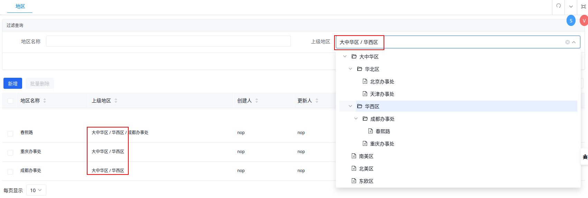

import Header from '../../../\_header.md';

<Header />

这一版将实现对 `Employee` 的条件查询，并抽取模型的基础 DSL。

下载 [nop-demo.orm.v2.xlsx](./files/nop-demo.orm.v2.xlsx) 并覆盖工程目录下的
`model/nop-demo.orm.xlsx` 文件，再通过 `nop-cli gen` 生成模型和前端页面：

```bash
export JAVA_HOME=/usr/lib/jvm/java-17-openjdk

${JAVA_HOME}/bin/java \
  -Dfile.encoding=UTF8 \
  -jar ./nop-cli.jar \
  gen -t=/nop/templates/orm \
  ./model/nop-demo.orm.xlsx
```

- 可用的控件见 Nop 平台中的 `nop-web/src/main/resources/_vfs/nop/web/xlib/control.xlib`

## 地区列表左侧添加导航树

- 以 `@:` 为前缀的值按照 json 格式解析

## 员工列表上部添加过滤查询

## 沿父级显示全部父节点名称


该定制涉及以下方面：

- 在 GraphQL Selection 中需设置获取足够的嵌套层级的 `parent{name}`
  - GraphQL 不支持递归嵌套，只能显式嵌套多级层级结构
- `parent` 的显示组件上需沿 `parent` 路径获取全部父节点名称后，再拼接在一起显示，
  但仅显示内容按此变化，隐射的 `parent.id` 依然为直接父节点

也就是，需对 GraphQL 请求参数进行修改，并重新组装返回结果。

Nop 平台所使用的 AMIS 框架支持对
[API 请求](https://baidu.github.io/amis/zh-CN/docs/types/api)
进行前处理（`requestAdaptor`）和后处理（`adaptor`），
因此，可以在这两处位置实现相应的定制化处理。

由于地区和部门的前端页面都需进行相同的改造，所以，
针对 `<api/>` 的定制化修改需提取到一个 Xpl 库中，以便于复用该类修改：

```xml title="nop-demo-delta/src/main/resources/_vfs/_delta/v2/nop/demo/pages/nested.xlib"
<?xml version="1.0" encoding="UTF-8" ?>
<lib xmlns:x="/nop/schema/xdsl.xdef" x:schema="/nop/schema/xlib.xdef">
  <tags>
    <!-- AMIS 采用的是 json 格式数据，故需设置 Xpl 函数的输出为 xjson -->
    <GridListApi outputMode="xjson">
      <!-- 声明必须传递的参数 bizObjName，以指定业务模型名称 -->
      <attr name="bizObjName" mandatory="true"/>

      <source>
        <!--
        any 标签会与调用 x:gen-extends 标签的父节点合并，
        所以，这里的标签名没有意义，只是用于确保其子节点能够合并为目标节点的子节点
        -->
        <any>
          <api url="@query:${bizObjName}__findPage" gql:selection="{@pageSelection}">
            <!-- 调用当前库（thisLib）的函数 ApiRequestAdaptor -->
            <thisLib:ApiRequestAdaptor/>
            <adaptor><![CDATA[
              const mutate = (item) => {
                // 组装父级数据
              };
              payload.data.items.forEach(mutate);

              return payload;
            ]]></adaptor>
          </api>
        </any>
      </source>
    </GridListApi>

    <!-- 对查看页面的定制支持 -->
    <GetInitApi outputMode="xjson">
      <attr name="bizObjName" mandatory="true"/>

      <source>
        <any>
          <initApi url="@query:${bizObjName}__get?id=$id" gql:selection="{@formSelection}">
            <thisLib:ApiRequestAdaptor/>
            <adaptor><![CDATA[
              const mutate = (item) => {
                // 组装父级数据
              };
              mutate(payload.data);

              return payload;
            ]]></adaptor>
          </initApi>
        </any>
      </source>
    </GetInitApi>

    <ApiRequestAdaptor outputMode="xjson">
      <source>
        <!-- 以字符串替换方式，将请求中的 gql:selection 进行修改 -->
        <requestAdaptor><![CDATA[
          const selection = api['gql:selection'];
          api['gql:selection'] =
            selection.replaceAll(
              'parent{name}',
              'parent{name,parent{name}}'
            );

          return api;
        ]]></requestAdaptor>
      </source>
    </ApiRequestAdaptor>
  </tags>
</lib>
```

> `requestAdaptor` 和 `adaptor` 内都是 js 代码，其为 AMIS API 的适配器函数体，
> 该函数体内可访问的变量可查看
> [AMIS API 文档](https://baidu.github.io/amis/zh-CN/docs/types/api)。

其中，对响应数据的再组装（`mutate`）的逻辑如下：

```js
let p = item.parent;
const names = [];
while (p) {
  names.push(p.name);
  p = p.parent;
}

if (item.parent) {
  item.parent.name = names.reverse().join(' / ');
}
```

> 暂时未找到可复用 js 的简便方式，故而，以上代码需复制到多处位置。

接着，在页面视图 `*.view.xml` 中调用前面的 Xpl 函数，以实现对 `<api/>` 的定制：

```xml {8,11,22-24} title="nop-demo-delta/src/main/resources/_vfs/_delta/v2/nop/demo/pages/Region/Region.view.xml"
<?xml version="1.0" encoding="UTF-8" ?>
<view xmlns:x="/nop/schema/xdsl.xdef"
      x:schema="/nop/schema/xui/xview.xdef"
      x:extends="super">

  <pages>
    <!-- 该数据的管理列表页面 -->
    <crud name="main" grid="list">
      <table>
        <!-- 编译时扩展 -->
        <x:gen-extends>
          <!-- 标签前缀与库文件名相同 -->
          <nested:GridListApi
              bizObjName="Region"
              xpl:lib="/nop/demo/pages/nested.xlib"/>
        </x:gen-extends>
      </table>
    </crud>

    <!-- 该数据的弹出选择框 -->
    <picker name="picker" grid="pick-list"
            x:prototype="main"
            x:prototype-override="bounded-merge">
      <table noOperations="true"/>
    </picker>

    <!-- 单条数据的查看页面 -->
    <simple name="view" form="view">
      <x:gen-extends>
        <nested:GetInitApi
            bizObjName="Region"
            xpl:lib="/nop/demo/pages/nested.xlib"/>
      </x:gen-extends>
    </simple>
  </pages>
</view>
```

在页面视图中，`main` 页面的 `grid` 默认为 `tree-list`，其为树形表格，
需修改为普通表格 `list`。由于数据的弹出选择框 `picker` 与其管理列表是相同的，
只是去掉了对数据的处理按钮，故而，其可以仅复用（`bounded-merge`）页面
`main` 的 `table` 结构，并去掉列表中的【操作】列（`noOperations="true"`）即可。


## 过滤父节点的全部子孙节点



该定制需满足以下要求：
- 涉及改动的地方要尽可能少，并保持一定的通用性
- 仅在前端包含按父节点过滤的条件时，才对其补充多级父节点过滤条件，
  同时保证其他过滤条件不变

注意，在 Nop 中若是需要新增查询条件，则需要在 `*.xmeta` 中定义
`prop`，并设置 `queryable="true"`，这样才能根据该属性进行查询过滤：

```xml {7}
<?xml version="1.0" encoding="UTF-8" ?>
<meta xmlns:x="/nop/schema/xdsl.xdef"
      x:schema="/nop/schema/xmeta.xdef"
      x:extends="super">

    <props>
        <prop name="parent.parentId" internal="true" queryable="true">
            <schema type="String"/>
        </prop>
    </props>
</meta>
```

但是，级联属性默认是以 `inner join` 方式连接关联表的，并且不能指定和修改该默认行为，
只能在对应的 `BizModel` 中新增 GraphQL 查询接口或扩展现有的接口，并通过构造
[EQL](https://gitee.com/canonical-entropy/nop-entropy/blob/master/docs/dev-guide/orm/eql.md)
的方式显示指定关联对象的连接方式为 `left join`，从而实现对父节点的子孙节点的查询。

以对 `Region` 的定制为例，先重载其 `doFindPage` 接口，在其查询条件包含 `parentId`
时做子孙节点的过滤查询：

```java {13-15,17} title="io.nop.demo.service.entity.RegionBizModel"
@BizModel("Region")
public class RegionBizModel extends CrudBizModel<Region> {

  @Override
  public PageBean<Region> doFindPage(
    QueryBean query, BiConsumer<QueryBean, IServiceContext> prepareQuery,
    FieldSelectionBean selection, IServiceContext context
  ) {
    TreeBean filter = query.getFilter();

    if (filter != null) {
      for (TreeBean child : filter.getChildren()) {
        if (child.getTagName().equals("eq") //
            && child.getAttr("name").equals("parentId") //
            && child.getAttr("value") != null //
        ) {
          return doFindChildrenPage(
            query, child, prepareQuery, selection, context
          );
        }
      }
    }

    return super.doFindPage(query, prepareQuery, selection, context);
  }
}
```

然后，根据查询条件 `QueryBen` 构造 `SQL`（其采用 EQL 语法）：


```java {12}
  private SQL newJoinedSQL(QueryBean query, boolean counting) {
    SQL.SqlBuilder sql = SQL.begin();
    sql.name(query.getName());
    sql.disableLogicalDelete(query.isDisableLogicalDelete());

    String entityAlias = "o";
    sql.append("select ").append(counting ? "count(1)" : entityAlias)
        .append(" from ").append(getEntityName()).as(entityAlias);

    // 显式限定仅查询 4 个层级
    String[] parentAliases = new String[]{
      entityAlias, "p1", "p2", "p3"
    };

    // left join Region p1 on p1.id = o.parentId
    // left join Region p2 on p2.id = p1.parentId
    for (int i = 1; i < parentAliases.length; i++) {
      String prev = parentAliases[i - 1];
      String curr = parentAliases[i];

      sql.br()
        .append("left join ")
        .append(getEntityName()).as(curr)
        .append(" on ").append(curr).append(".id = ")
        .append(prev).append(".parentId");
    }

    DaoQueryHelper.appendWhere(
      sql, entityAlias, query.getFilter()
    );

    if (!counting) {
      DaoQueryHelper.appendOrderBy(
        sql, entityAlias, query.getOrderBy()
      );
    }

    return sql.end();
  }
```

最后，通过 ORM 查询分页数据：

```java {19,23,29,31-32}
  private PageBean<Region> doFindChildrenPage(
    QueryBean query, TreeBean parentFilter,
    BiConsumer<QueryBean, IServiceContext> prepareQuery,
    FieldSelectionBean selection, IServiceContext context
  ) {
    prepareFindPageQuery(query, "doFindChildrenPage", context);
    if (prepareQuery != null) {
      prepareQuery.accept(query, context);
    }

    PageBean<Region> pageBean = new PageBean<>();
    pageBean.setLimit(query.getLimit());
    pageBean.setOffset(query.getOffset());
    pageBean.setTotal(-1L);

    // 添加各层级的父节点过滤条件
    Object value = parentFilter.getAttr("value");
    List<TreeBean> filters =
      Arrays.stream(new String[]{ "p1", "p2", "p3" })
              .map((alias) ->
                eq("parentId", value)
                  // 指定过滤属性所属的对象别名: p1.parentId = ?
                  .attr("owner", alias)
              )
              .collect(Collectors.toList());
    filters.add(parentFilter);

    // 过滤掉已逻辑删除的数据
    TreeBean filter = and(or(filters), eq("deleted", 0));

    query.setDisableLogicalDelete(true);
    query.getFilter().replaceChild(parentFilter, filter);

    if (selection != null
        && selection.hasField(GraphQLConstants.FIELD_TOTAL)
    ) {
      SQL sql = newJoinedSQL(query, true);

      long total = orm().runInSession(session ->
                          orm().findLong(sql, 0L)
                        );
      pageBean.setTotal(total);
    }

    if (selection == null
        || selection.hasField(GraphQLConstants.FIELD_ITEMS)
    ) {
      SQL sql = newJoinedSQL(query, false);

      List<Region> ret = orm().runInSession(session ->
                                orm().findPage(
                                  sql,
                                  query.getOffset(),
                                  query.getLimit()
                                )
                              );
      pageBean.setItems(ret);
    }

    return pageBean;
  }
```

对于以上代码需注意以下几点：
- `attr("owner", alias)` 是为该过滤属性设置所属对象的别名，
  最终，在 `where` 中拼装的条件便是 `p1.parentId = ?` 形式。
  若对过滤条件不设置 `owner`，则默认采用主体对象的别名 `o` 拼接属性，如
  `o.parentId`
- 由于默认的逻辑删除过滤会以 `and` 方式对各级关联对象都附加
  `deleted = 0` 的过滤条件，使得最终结果仅为最后层级的数据，
  故而，需要通过 `query.setDisableLogicalDelete(true)`
  禁用该行为，并仅对查询主体对象进行逻辑删除过滤即可：`eq("deleted", 0)`

由于是对已有分页查询接口的直接定制，故而，不需要修改和调整前端。

## 增加查询条件

> 详情请参考 [为列表页面增加多个查询条件](https://gitee.com/canonical-entropy/nop-entropy/blob/master/docs/dev-guide/xui/xview.md#4-%E4%B8%BA%E5%88%97%E8%A1%A8%E9%A1%B5%E9%9D%A2%E5%A2%9E%E5%8A%A0%E5%A4%9A%E4%B8%AA%E6%9F%A5%E8%AF%A2%E6%9D%A1%E4%BB%B6)。

Nop 默认采用 `eq` 进行查询，若是要采用模糊查询，则需要在
`*.xmeta` 中为相关属性设置 `allowFilterOp`。比如，为 `Region`
的 `name` 属性增加 `contains` 查询（等同于 SQL 中的 `LIKE`）：

```xml {7} title="nop-demo-delta/src/main/resources/_vfs/_delta/v2/nop/demo/model/Region/Region.xmeta"
<?xml version="1.0" encoding="UTF-8" ?>
<meta xmlns:x="/nop/schema/xdsl.xdef"
      x:schema="/nop/schema/xmeta.xdef"
      x:extends="super">

  <props>
    <prop name="name" allowFilterOp="eq,contains"/>
  </props>
</meta>
```

只有声明可用的过滤算符，才能在过滤表单中对该属性启用对应的算符：

```xml {13} title="nop-demo-delta/src/main/resources/_vfs/_delta/v2/nop/demo/pages/Region/Region.view.xml"
<?xml version="1.0" encoding="UTF-8" ?>
<view xmlns:x="/nop/schema/xdsl.xdef"
      x:schema="/nop/schema/xui/xview.xdef"
      x:extends="super">

  ...
  <forms>
    <form id="query" submitOnChange="true">
      <layout>
          parentId[上级地区] name[地区名称]
      </layout>
      <cells>
          <cell id="name" filterOp="contains" control="string"/>
      </cells>
    </form>
    ...
  </forms>
</view>
```

> `submitOnChange="true"` 设置过滤表单有值发生变化，则自动提交新的查询并刷新查询列表。

## 注意事项

- `xpl:lib` 必须为 Delta 层的绝对路径，不能是相对路径
- 使用 `xpl:lib` 的标签前缀需与库文件名相同
- 若在 Delta 层中修改 `*.page.yaml`，其 `view` 属性值必须为 Delta 层的绝对路径，
  若使用相对路径，则其引用的将是 vfs 初始层的文件
- EQL 中没有布尔值，需对 `Boolean` 的过滤属性赋值为 `0` 或 `1`

## 参考资料

- [Nop - 面向对象的 GraphQL](https://gitee.com/flytreeleft/nop-entropy/blob/docs-changes/docs/dev-guide/graphql/graphql-java.md)
- [Nop EQL 对象查询语言](https://gitee.com/canonical-entropy/nop-entropy/blob/master/docs/dev-guide/orm/eql.md)
- [AMIS API 配置文档](https://baidu.github.io/amis/zh-CN/docs/types/api)
