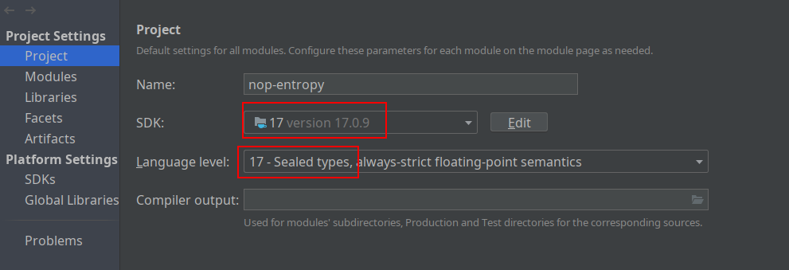

import Header from '../../\_header.md';

<Header />

## 本地开发

环境要求：

- JDK 17+
- Maven 3.9.3+

本地构建并发布：

```bash
export JAVA_HOME=/usr/lib/jvm/java-17-openjdk

mvn clean install -DskipTests -Dquarkus.package.type=uber-jar
```

> 以上命令也是为了便于拉取 Maven 依赖包，避免 IDEA 下载依赖出现问题。

在 IDEA 导入项目后，需调整项目配置（File -> Project Structure...）：



> 确保 IDEA 的 Maven 配置（File -> Settings -> Build, Execution, Deployment -> Maven -> Local repository）
> 指向了与 `mvn` 命令相同的仓库路径。

## 文件职能

注意，以下划线开头的以下后缀文件均为自动生成，不能手工修改以避免被覆盖，
手工修改的部分应该放在 `src/resources/_vfs/_delta/<xxx>/`
下的同名文件中（可在不同的子工程中，通过依赖引入即可），其中，`<xxx>` 表示 Delta 分层标识，
默认分层为 `default`，可以在定制化需求场景中增加不同的分层来管理不同场景下的 Delta。

> 分层的顺序由 `nop.core.vfs.delta-layer-ids` 控制，
> 如，`nop.core.vfs.delta-layer-ids=base,hunan`
> 表示先应用 `base` 再应用 `hunan`。

- `*.xdef`：DSL 的 Schema 定义
- `*.xlib`：[xpl](https://gitee.com/canonical-entropy/nop-entropy/blob/master/docs/dev-guide/xlang/xpl.md)
  模板语言的函数库，用于将公共的**可执行逻辑**抽取并定义为一个 DSL 标签，以便于在 DSL 中复用执行逻辑
- `*.xgen`：按照 Nop 的 `_vfs` 路径生成模板代码
  - 在使用 maven 打包功能时，会自动执行工程的 `precompile` 和 `postcompile` 目录下的 `*.xgen` 代码，
    其中 `precompile` 在 compile 阶段之前执行，执行环境可以访问所有依赖库，
    但是不能访问当前工程的类目录，而 `postcompile` 在 compile 阶段之后执行，
    可以访问已编译的类和资源文件
- `*.xrun`：`nop-codegen` 专用 DSL，用于按照模板生成代码和 Delta 文件
- `*.xbiz`：对无代码开发模式的支持，可以在不修改 Java 源代码的情况下，
  在线增加、修改后台 GraphQL 模型中的 `Query/Mutation/DataLoader`，
  其内置了有限自动机模型，一些简单的状态迁移逻辑无需在 Java 中编程，通过配置即可完成
- `*.xmeta`：用于定义模型的描述信息，据此可以自动实现对数据增删改查的全部逻辑

- `_module`：空白文件，放在 `src/resources/_vfs/xxx/yyy/`（`appName` 为 `xxx-yyy`）
  中用于标识当前包是否为一个 Nop 模块，若为模块，
  则会自动加载其 `/_vfs/xxx/yyy/beans/` 目录下的 `app-*.beans.xml` 文件
