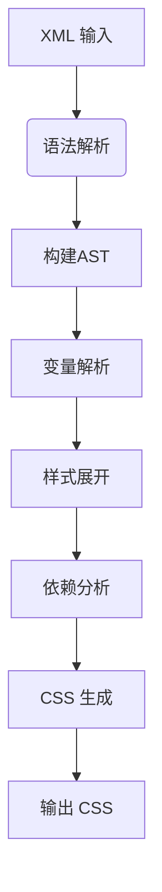

import {Conversation, Ask, Reply, Note} from '@site/src/components/Conversation';

<Conversation
asker={{ img: '/img/avatar/anonymous.svg' }}
replier={{ img: '/img/avatar/deepseek.svg' }}>

<Ask>

## Web 端的主题实现机制 {#theme-on-web}

</Ask>

<Reply>

<details><summary>AI 思考过程</summary>

嗯，用户问的是 Web 端的主题实现机制，我需要详细回答这个。
首先，我得回想一下常见的主题切换方法。
可能有 CSS 变量、预处理器的切换，或者类名控制。
然后还要考虑用户偏好，比如通过媒体查询检测暗色模式。
另外，JavaScript 的动态切换也很重要，可能需要用 localStorage 保存用户选择。

接下来，应该分点说明不同的方法。比如 CSS 变量部分，要讲定义变量和如何切换。
预处理器的例子可以用 Sass 或 Less，但可能不如 CSS 变量灵活。
类名控制的话，可能需要不同的 CSS 文件或者覆盖样式。
然后是媒体查询，自动适应系统的主题设置，这部分需要示例代码。

动态切换部分要结合 JavaScript，如何修改类名或者 CSS 变量，以及保存用户偏好。
还有需要考虑服务器端渲染时如何保留主题状态，可能用 Cookie 或者后端存储。
最后，注意事项比如回退方案、性能优化，以及自定义主题的高级功能，比如颜色选择器。

要确保每个部分都有示例代码，这样用户更容易理解。还要检查有没有遗漏的点，
比如主题切换时的过渡动画，或者如何处理图片和图标的不同主题。
可能需要提到使用 SVG 或者字体图标来适应主题颜色变化。
另外，可访问性也是一个方面，确保主题切换不影响阅读体验。

总之，结构要清晰，分点列出不同的机制，每个机制都给出实现方式和示例，
同时涵盖相关的最佳实践和注意事项。这样用户就能全面了解 Web 主题的实现方法了。

</details><br/>

Web 端的主题实现机制通常涉及 CSS、JavaScript 和可能的服务端技术，
目的是实现动态切换页面样式（如颜色、字体、布局等）。以下是常见的实现方式及技术细节：

<br/>

---

### 1. **CSS 变量（Custom Properties）** {#theme-on-web-by-custom-props}

- **核心机制**：通过定义 CSS 变量（如 `--primary-color`）并在样式中引用这些变量，
  动态修改变量值即可全局改变主题。
- **实现步骤**：
  1. **定义变量**：
  ```css
  :root {
    --primary-color: #3498db;
    --background-color: #ffffff;
  }
  ```
  2. **引用变量**：
  ```css
  body {
    background-color: var(--background-color);
  }
  button {
    background-color: var(--primary-color);
  }
  ```
  3. **切换变量**（通过 JavaScript）：
  ```javascript
  // 切换到暗色主题
  document.documentElement.style.setProperty('--primary-color', '#2c3e50');
  document.documentElement.style.setProperty('--background-color', '#1a1a1a');
  ```
- **优点**：轻量级、无需加载额外 CSS 文件，适合简单主题切换。

<br/>

---

### 2. **CSS 预处理器（Sass/Less）生成多套主题** {#theme-on-web-by-preprocessor}

- **核心机制**：通过预处理器（如 Sass）生成多套主题的 CSS 文件，通过切换 CSS 类名或文件实现主题变更。
- **实现步骤**：

  1. 使用变量定义主题：

  ```scss
  // light-theme.scss
  $primary-color: #3498db;
  $background-color: #ffffff;

  // dark-theme.scss
  $primary-color: #2c3e50;
  $background-color: #1a1a1a;
  ```

  2. 编译为独立 CSS 文件（如 `light-theme.css` 和 `dark-theme.css`）。
  3. 通过 JavaScript 动态切换 CSS 文件：

  ```javascript
  function switchTheme(themeName) {
    const link = document.getElementById('theme-style');
    link.href = `${themeName}.css`;
  }
  ```

- **缺点**：需预先生成多套 CSS，可能增加加载时间。

<br/>

---

### 3. **CSS 类名控制** {#theme-on-web-by-css-class}

- **核心机制**：通过为 HTML 根元素（如 `<html>` 或 `<body>`）添加不同的类名（如
  `theme-dark`），触发对应的 CSS 样式。
- **实现步骤**：
  1. 定义不同类名下的样式：
  ```css
  body.theme-light {
    --primary-color: #3498db;
    --background-color: white;
  }
  body.theme-dark {
    --primary-color: #2c3e50;
    --background-color: #1a1a1a;
  }
  ```
  2. 通过 JavaScript 切换类名：
  ```javascript
  document.body.classList.remove('theme-light');
  document.body.classList.add('theme-dark');
  ```
- **优点**：简单高效，结合 CSS 变量更灵活。

<br/>

---

### 4. **通过 `prefers-color-scheme` 适配系统主题** {#theme-on-web-by-prefers-color-scheme}

- **核心机制**：使用 CSS 媒体查询 `@media (prefers-color-scheme: dark)` 自动匹配用户系统主题。
- **实现示例**：

  ```css
  :root {
    --primary-color: #3498db;
    --background-color: #ffffff;
  }

  @media (prefers-color-scheme: dark) {
    :root {
      --primary-color: #2c3e50;
      --background-color: #1a1a1a;
    }
  }
  ```

- **局限**：仅响应系统设置，无法手动切换。

<br/>

---

### 5. **JavaScript 动态主题切换** {#theme-on-web-by-js}

- **核心机制**：结合 CSS 变量或类名，通过 JavaScript 动态修改主题并保存用户偏好。
- **实现示例**：

  ```javascript
  // 切换主题函数
  function toggleTheme() {
    const body = document.body;
    body.classList.toggle('dark-theme');
    // 保存到 localStorage
    const isDark = body.classList.contains('dark-theme');
    localStorage.setItem('theme', isDark ? 'dark' : 'light');
  }

  // 初始化时读取主题
  const savedTheme = localStorage.getItem('theme');
  if (savedTheme === 'dark') {
    document.body.classList.add('dark-theme');
  }
  ```

- **存储方式**：`localStorage`、`Cookie` 或后端数据库。

<br/>

---

### 6. **服务端主题渲染（SSR 场景）** {#theme-on-web-by-ssr}

- **核心机制**：在服务端根据用户设置（如 Cookie）返回不同主题的 HTML 或 CSS。
- **实现示例**：
  1. 用户通过 Cookie 传递主题偏好（如 `theme=dark`）。
  2. 服务端渲染时动态添加类名或内联样式：
  ```html
  <body class="<% if (theme === 'dark') { %>dark-theme<% } %>"></body>
  ```
- **优点**：避免页面闪烁（FOUC）。

<br/>

---

### 7. **主题切换的视觉过渡** {#theme-on-web-transition}

- **平滑动画**：通过 CSS `transition` 属性让主题切换更自然。
  ```css
  body {
    transition: background-color 0.3s ease, color 0.3s ease;
  }
  ```

<br/>

---

### 注意事项 {#theme-on-web-notices}

1. **回退方案**：确保在不支持 CSS 变量的浏览器中有默认样式。
2. **性能优化**：避免频繁重绘（如减少 `box-shadow` 变化）。
3. **可访问性**：主题切换不应影响文字对比度（满足 WCAG 标准）。

<br/>

---

### 高级方案 {#theme-on-web-advance}

- **CSS-in-JS**：使用 styled-components 或 Emotion 等库动态生成样式。
- **CSS 属性级控制**：通过 `color-scheme` 属性适配表单控件主题。
- **用户自定义主题**：允许用户通过颜色选择器自定义变量值。

通过上述机制的组合，可以实现灵活、高效且用户友好的主题系统。

</Reply>

<Ask>

## Android 端的主题实现机制 {#theme-on-android}

</Ask>

<Reply>

<details><summary>AI 思考过程</summary>

嗯，用户之前问了 Web 端的主题实现机制，现在又转向 Android 端的主题实现机制。
看起来他们可能在开发跨平台应用，需要统一或对比不同平台的主题机制。
首先，我需要回想一下 Android 的主题系统，包括资源系统、主题和样式的区别，
以及 Material Design 组件的作用。

用户可能已经了解 Web 端使用 CSS 变量、类名切换等方法，
现在想了解 Android 如何实现类似功能。Android 的主题机制和 Web 不同，
主要基于 XML 定义主题属性，然后通过主题继承和覆盖来实现。
可能需要解释如何定义主题，应用主题到组件，以及动态切换主题的方法。

另外，用户可能关心的是如何动态切换主题，比如夜间模式或者用户自定义主题。
这时候需要考虑 Android 的资源限定符，比如夜间模式使用 `-night`
后缀的资源目录，或者通过 `AppCompatDelegate.setDefaultNightMode`
来动态切换。同时，可能需要提到保存用户偏好，使用 `SharedPreferences` 或者数据库。

还要注意 Android 的版本差异，比如在 Android 10 及以上支持深色主题，
而旧版本可能需要兼容处理。另外，动态切换主题时，如何避免重启 `Activity`，
或者如何让更改立即生效，可能需要使用 `recreate()` 方法，或者更细致的资源管理。

用户可能还希望了解 Material Design 组件中的主题定制，
比如颜色、形状、排版等属性的定义，以及如何通过 `ThemeOverlay`
来微调特定组件的样式。此外，自定义视图如何处理主题属性，
确保它们能够响应主题变化，这也是一个重要点。

需要检查是否有遗漏的部分，比如主题和样式的区别，主题属性的继承关系，
以及如何通过工具如 Android Studio 的 Theme Editor
来可视化编辑主题。可能还需要提到测试不同主题的方法，确保在各种设备和版本上表现一致。

最后，用户可能对实现动态主题切换的具体步骤感兴趣，比如定义多个主题，
根据用户选择应用相应的主题，保存设置，并在应用重启时恢复。
这时候需要提供一个代码示例，展示如何使用 `SharedPreferences`
保存主题偏好，并在 `Activity` 中应用。

总结来说，回答需要涵盖 Android 主题的基础概念、定义方法、动态切换技术、兼容性处理，
以及相关的最佳实践和工具支持。确保内容结构清晰，逐步引导用户理解从基础到高级的主题实现机制。

</details><br/>

在 Android 端，主题（Themes）和样式（Styles）的实现机制与 Web 端有显著差异，
主要依赖于 Android 的资源系统（Resource System）和 XML 定义。
以下是 Android 主题的实现机制及关键细节：

<br/>

---

### **1. 主题（Themes）与样式（Styles）的区别** {#theme-on-android-diff-theme-and-style}

- **样式（Styles）**：定义一组属性（如文本大小、颜色、边距）的集合，用于单个视图（View）的外观。
- **主题（Themes）**：定义全局属性集合，应用于整个应用或 Activity，
  影响所有组件（如状态栏、导航栏、默认按钮样式等）。

<br/>

---

### **2. 主题的实现机制** {#theme-on-android-implement}

#### **(1) 在 `res/values/themes.xml` 中定义主题** {#theme-on-android-implement-by-xml}

通过 XML 文件定义主题，继承自系统主题（如 `Theme.Material3.DayNight`）并覆盖属性：

```xml
<!-- 亮色主题 -->
<style name="AppTheme.Light" parent="Theme.Material3.DayNight.NoActionBar">
  <item name="colorPrimary">@color/primary</item>
  <item name="colorOnPrimary">@color/on_primary</item>
  <item name="colorSurface">@color/background_light</item>
</style>

<!-- 暗色主题 -->
<style name="AppTheme.Dark" parent="Theme.Material3.DayNight.NoActionBar">
  <item name="colorPrimary">@color/primary_dark</item>
  <item name="colorOnPrimary">@color/on_primary_dark</item>
  <item name="colorSurface">@color/background_dark</item>
</style>
```

#### **(2) 应用主题** {#theme-on-android-implement-apply}

在 `AndroidManifest.xml` 中为应用或 Activity 指定默认主题：

```xml
<application
  android:theme="@style/AppTheme.Light">
  <!-- ... -->
</application>
```

<br/>

---

### **3. 动态主题切换（如夜间模式）** {#theme-on-android-theme-switch}

Android 提供了对深色主题（Dark Theme）的原生支持，可通过以下方式实现动态切换：

#### **(1) 使用 `AppCompatDelegate`** {#theme-on-android-theme-switch-code}

通过 `AppCompatDelegate.setDefaultNightMode()` 动态切换主题模式：

```kotlin
// 切换到深色模式
AppCompatDelegate.setDefaultNightMode(AppCompatDelegate.MODE_NIGHT_YES)

// 切换到浅色模式
AppCompatDelegate.setDefaultNightMode(AppCompatDelegate.MODE_NIGHT_NO)

// 跟随系统设置
AppCompatDelegate.setDefaultNightMode(AppCompatDelegate.MODE_NIGHT_FOLLOW_SYSTEM)
```

#### **(2) 重启 Activity 使主题生效** {#theme-on-android-theme-switch-recreate}

切换主题后需重启当前 Activity：

```kotlin
activity.recreate()
```

#### **(3) 保存用户偏好** {#theme-on-android-theme-switch-save}

使用 `SharedPreferences` 保存用户选择的主题模式：

```kotlin
val preferences = getSharedPreferences("settings", Context.MODE_PRIVATE)
preferences.edit().putInt("theme_mode", mode).apply()
```

<br/>

---

### **4. 主题与 Material Design 组件集成** {#theme-on-android-with-material}

Material Design 组件库（MDC）提供了深度主题化支持：

#### **(1) 颜色系统** {#theme-on-android-with-material-color}

- **语义颜色**：通过 `colorPrimary`、`colorSecondary` 等属性定义主题颜色。
- **颜色角色**：使用 `colorOnPrimary`（在 `colorPrimary` 上的文本颜色）、`colorSurface`（背景色）等。

#### **(2) 形状系统** {#theme-on-android-with-material-shape}

定义全局形状（如圆角）：

```xml
<style name="AppTheme" parent="Theme.Material3.DayNight">
  <item name="shapeAppearanceSmallComponent">@style/ShapeAppearance.SmallComponent</item>
  <item name="shapeAppearanceMediumComponent">@style/ShapeAppearance.MediumComponent</item>
</style>
```

#### **(3) 排版系统** {#theme-on-android-with-material-text}

通过 `textAppearance` 定义全局字体和文字样式：

```xml
<style name="TextAppearance.Body" parent="TextAppearance.Material3.BodyMedium">
  <item name="fontFamily">@font/roboto</item>
  <item name="android:textSize">16sp</item>
</style>
```

<br/>

---

### **5. 多主题资源管理** {#theme-on-android-mutiple}

Android 通过资源限定符（Qualifiers）自动加载不同主题资源：

- **夜间模式资源**：将暗色主题资源放在 `res/values-night` 目录中。
- **自定义主题资源**：通过资源限定符（如 `values-theme-red`）实现多主题。

<br/>

---

### **6. 动态主题属性（Theme Overlay）** {#theme-on-android-overlay}

通过 `ThemeOverlay` 覆盖特定组件的样式，无需修改全局主题：

```xml
<style name="ThemeOverlay.RedButton" parent="">
  <item name="colorPrimary">@color/red</item>
</style>

<!-- 在布局中应用 -->
<Button
    android:theme="@style/ThemeOverlay.RedButton"
    android:text="Red Button" />
```

<br/>

---

### **7. 自定义主题属性** {#theme-on-android-custom}

定义自定义主题属性供组件使用：

1. **在 `res/values/attrs.xml` 中定义属性**：

```xml
<resources>
  <attr name="customColor" format="color|reference" />
</resources>
```

2. **在主题中设置属性值**：

```xml
<style name="AppTheme" parent="Theme.Material3">
  <item name="customColor">@color/red</item>
</style>
```

3. **在代码或布局中使用**：

```kotlin
val typedValue = TypedValue()
context.theme.resolveAttribute(R.attr.customColor, typedValue, true)
val color = typedValue.data
```

<br/>

---

### **8. 兼容性处理** {#theme-on-android-compat}

- **旧版本兼容**：使用 `AppCompat` 主题（如 `Theme.AppCompat.DayNight`）支持 Android 5.0+。
- **动态颜色（Android 12+）**：通过 `dynamicColor` 适配系统动态主题：
  ```xml
  <item name="android:dynamicColorThemeOverlay">@style/ThemeOverlay.DynamicColors</item>
  ```

<br/>

---

### **9. 常见问题与优化** {#theme-on-android-notices}

1. **避免主题泄露**：在自定义视图中正确使用 `ContextThemeWrapper`。
2. **性能优化**：减少主题切换时的布局重绘。
3. **测试多主题**：使用 Android Studio 的 **Layout Inspector** 或 **Emulator** 验证不同主题效果。

<br/>

---

### 示例：完整动态主题切换 {#theme-on-android-demo}

```kotlin
// 保存主题模式
fun saveThemeMode(context: Context, mode: Int) {
  val preferences = context.getSharedPreferences("settings", Context.MODE_PRIVATE)
  preferences.edit().putInt("theme_mode", mode).apply()
}

// 加载主题模式
fun applySavedTheme(context: Context) {
  val preferences = context.getSharedPreferences("settings", Context.MODE_PRIVATE)
  val mode = preferences.getInt("theme_mode", AppCompatDelegate.MODE_NIGHT_FOLLOW_SYSTEM)
  AppCompatDelegate.setDefaultNightMode(mode)
}

// 在 Activity 的 onCreate 中调用
override fun onCreate(savedInstanceState: Bundle?) {
  super.onCreate(savedInstanceState)
  applySavedTheme(this)
  setContentView(R.layout.activity_main)
}
```

<br/>

---

### 总结 {#theme-on-android-summary}

Android 主题的实现机制基于资源系统、XML 定义和 Material Design 组件，通过以下核心步骤：

1. **定义主题**：覆盖颜色、形状、排版等属性。
2. **动态切换**：使用 `AppCompatDelegate` 和 `recreate()`。
3. **资源管理**：通过限定符加载不同主题资源。
4. **深度定制**：利用 `ThemeOverlay` 和自定义属性。

结合 Material Design 3 的动态颜色和组件主题化能力，可构建高度灵活且视觉统一的应用主题系统。

</Reply>

<Ask>

## 采用 XML 编写函数式自举 CSS {#xml-function-css}

以 xml 设计一套新的 html css 系统，其可以像函数一样向自定义的样式传递动态参数，
并且样式之间可以相互引用，类似于函数内调用其他函数，实现样式的自举，
只需要保证结构的完备性，最终由专门的编译器将其结构变换为真实的 css 定义。
要求样式名称作为 xml 标签名，样式参数为 xml 标签属性，嵌套样式作为子节点，
同时，在变量节点内定义变量，用以支持定义不同的主题

</Ask>

<Reply>

<details><summary>AI 思考过程</summary>

好的，我现在需要帮助用户设计一个基于 XML 的 HTML/CSS 系统，
满足他们的要求：样式名称作为 XML 标签名，参数作为属性，嵌套样式作为子节点，
变量节点定义主题，最后通过编译器转换为真实 CSS。首先，我得理解用户的需求。
用户希望像函数一样传递动态参数，样式之间可以互相引用，实现自举，
也就是样式能够自我构建，不需要外部干预，同时支持主题变量。

首先，我需要考虑如何用 XML 结构来表示样式。
用户提到样式名称作为标签名，参数作为属性，嵌套作为子节点。
比如，定义一个按钮样式，可能有一个 `<ButtonStyle>`
标签，属性包括颜色、边距等，子节点可能包含其他样式的引用，比如
`HoverEffect`。变量部分需要单独定义，可能在 `<Variables>`
节点下，定义不同主题的颜色、字体等。

接下来，如何实现样式的相互引用。比如，在按钮样式中调用悬停效果样式，
可能需要类似函数调用的机制。在 XML 中，可能需要一个标签来表示引用，比如
`<UseStyle>`，并指定引用的样式名称，以及传递参数。
这需要编译器在转换时处理这些引用，展开成对应的 CSS 代码。

动态参数的传递需要处理变量的替换。用户希望在 XML 中定义变量，
然后在样式中使用这些变量。例如，在 `<Variables>` 节点下定义
`primary-color`，然后在按钮样式的属性中使用变量名，编译器在生成 CSS
时替换为实际的值。同时，可能需要支持主题切换，通过不同的变量集合来实现。

然后，样式的自举意味着基础样式可以组合成更复杂的样式，而无需外部定义。
例如，基础按钮样式可以包含边距、颜色，而复杂按钮可以继承基础样式并添加阴影、悬停效果。
在 XML 中，可以通过嵌套子节点来实现这种组合，编译器需要处理这些嵌套结构，
生成对应的 CSS 选择器和属性。

接下来需要考虑编译器的实现步骤。首先解析 XML 结构，识别样式定义、变量和引用关系。
然后建立依赖关系，确保引用的样式在生成时已经被定义。
处理变量替换，将变量名替换为具体的值，支持不同主题的切换。
最后生成标准的 CSS 文件，包含所有展开的样式规则。

还需要考虑 XML 的结构是否完备，比如如何处理样式的继承、覆盖，
如何处理重复定义的变量或样式，以及错误处理，比如循环引用或未定义的样式引用。
同时，生成的 CSS 需要处理作用域问题，避免样式污染。
可能需要为每个样式生成唯一的类名，或者在编译时处理选择器的嵌套。

此外，用户可能希望这个系统能够支持响应式设计，
比如根据不同的媒体查询应用不同的样式参数。
在 XML 中，可能需要定义媒体查询节点，包含子样式，
编译器在生成时将其转换为 `@media` 规则。

测试方面，可能需要编写示例 XML 文件，经过编译器转换后，
检查生成的 CSS 是否符合预期，包括变量替换、样式引用展开、嵌套结构处理等。

最后，可能需要考虑扩展性，比如添加自定义函数处理颜色混合、计算尺寸等，
类似于 Sass 的功能。在 XML 中，可能需要通过特定的标签或属性来表示这些函数，
编译器在转换时进行处理。

总结一下，设计步骤包括：定义 XML 结构，处理样式和变量，实现编译器解析和转换，
处理嵌套和引用，生成 CSS，并确保自举和主题支持。
需要确保结构清晰，避免循环依赖，处理变量作用域，以及错误检查。

</details><br/>

以下是基于 XML 设计的 HTML/CSS 函数式样式系统方案，支持动态参数传递、样式嵌套引用和主题变量定义：

```xml
<!-- 样式系统根节点 -->
<StyleSystem>
  <!-- 定义变量集合（主题） -->
  <Variables name="light-theme">
    <color.primary>#3498db</color.primary>
    <color.background>#ffffff</color.background>
    <spacing.unit>8px</spacing.unit>
  </Variables>

  <Variables name="dark-theme">
    <color.primary>#2c3e50</color.primary>
    <color.background>#1a1a1a</color.background>
  </Variables>

  <!-- 基础样式定义 -->
  <FlexLayout direction="column" gap="@{spacing.unit}">
    <Margin value="@{spacing.unit}"/>
    <Padding value="@{spacing.unit} * 2"/>
  </FlexLayout>

  <!-- 按钮组件样式 -->
  <ButtonStyle base="FlexLayout">
    <Background color="@color.primary"/>
    <Border radius="4px"/>

    <!-- 嵌套子样式 -->
    <HoverEffect>
      <Background color="darken(@color.primary, 10%)"/>
    </HoverEffect>

    <!-- 状态变体 -->
    <Variant name="secondary">
      <Background color="lighten(@color.primary, 20%)"/>
    </Variant>
  </ButtonStyle>

  <!-- 卡片组件样式 -->
  <CardStyle>
    <UseStyle name="FlexLayout"/>
    <Shadow level="2"/>
    <Border radius="8px"/>
    <Background color="@color.background"/>
  </CardStyle>
</StyleSystem>
```

<br/>

---

### **1. XML 结构规范** {#xml-function-css-spec}

| 节点            | 说明                              | 示例                             |
| --------------- | --------------------------------- | -------------------------------- |
| `<StyleSystem>` | 根节点，包含所有样式定义          | 整个文档根节点                   |
| `<Variables>`   | 定义变量集合（主题）              | `<Variables name="theme">...`    |
| `<StyleName>`   | 自定义样式标签（最终生成 CSS 类） | `<ButtonStyle>...</ButtonStyle>` |
| `<UseStyle>`    | 引用其他样式                      | `<UseStyle name="FlexLayout"/>`  |
| `<Variant>`     | 定义样式变体                      | `<Variant name="disabled">...`   |
| 属性值语法      | 使用 `@{}` 包裹动态表达式         | `gap="@{spacing.unit} * 2"`      |

<br/>

---

### **2. 编译器工作流程** {#xml-function-css-compile}



#### **关键处理步骤：** {#xml-function-css-compile-steps}

1. **变量解析**

- 替换所有 `@variable` 为实际值
- 支持表达式计算：`darken(@color.primary, 10%)`

2. **样式展开**

- 展开 `<UseStyle>` 为对应样式定义
- 处理嵌套样式形成级联关系

3. **依赖分析**

- 检测循环引用
- 确定样式生成顺序

4. **CSS 生成**

- 转换样式节点为 CSS 类
- 处理变体生成修饰符类

<br/>

---

### **3. 编译结果示例** {#xml-function-css-artifact}

输入 XML：

```xml
<ButtonStyle>
  <Background color="@color.primary"/>
  <Border radius="4px"/>
</ButtonStyle>
```

输出 CSS：

```css
.ButtonStyle {
  background-color: var(--color-primary);
  border-radius: 4px;
}

.ButtonStyle:hover {
  /* HoverEffect 展开结果 */
  background-color: #2980b9;
}

.ButtonStyle.secondary {
  background-color: #5dade2;
}
```

<br/>

---

### **4. 核心特性实现** {#xml-function-css-feature}

#### **(1) 动态参数传递** {#xml-function-css-feature-args}

```xml
<ResponsiveLayout breakpoints="sm:640px, md:768px">
  <MediaQuery name="sm">
    <Padding value="@{spacing.unit}"/>
  </MediaQuery>
  <MediaQuery name="md">
    <Padding value="@{spacing.unit} * 2"/>
  </MediaQuery>
</ResponsiveLayout>
```

#### **(2) 样式自举机制** {#xml-function-css-feature-self}

```xml
<BaseTypography>
  <FontFamily>system-ui</FontFamily>
  <LineHeight>1.5</LineHeight>
</BaseTypography>

<HeadingStyle base="BaseTypography">
  <FontSize>2rem</FontSize>
  <FontWeight>700</FontWeight>
</HeadingStyle>
```

#### **(3) 主题切换支持** {#xml-function-css-feature-theme}

```xml
<!-- 编译时指定主题 -->
<CompilerConfig>
  <ActiveTheme>dark-theme</ActiveTheme>
</CompilerConfig>
```

<br/>

---

### **5. 系统优势** {#xml-function-css-good}

| 特性           | 传统 CSS              | 本方案                  |
| -------------- | --------------------- | ----------------------- |
| **参数传递**   | 通过 CSS 变量实现     | XML 属性直接传递        |
| **样式组合**   | @apply 规则（已废弃） | 显式 `<UseStyle>` 引用  |
| **主题管理**   | 多个 CSS 文件切换     | 变量集合统一管理        |
| **响应式支持** | 媒体查询重复编写      | 声明式 breakpoints 系统 |
| **可读性**     | 选择器嵌套复杂        | 显式 XML 结构           |

<br/>

---

### **6. 高级功能扩展** {#xml-function-css-advance}

#### **(1) 条件样式** {#xml-function-css-advance-when}

```xml
<FeatureToggle name="darkMode">
  <When enabled="true">
    <Background color="#1a1a1a"/>
  </When>
  <Otherwise>
    <Background color="#ffffff"/>
  </Otherwise>
</FeatureToggle>
```

#### **(2) 循环生成** {#xml-function-css-advance-for}

```xml
<GenerateSpacingUnits from="1" to="5" step="1">
  <Spacing name="unit-@{value}" value="@{spacing.base} * @{value}"/>
</GenerateSpacingUnits>
```

#### **(3) 类型校验** {#xml-function-css-advance-validate}

```xml
<ColorValidator value="@color.primary">
  <AllowedFormats>hex, rgb</AllowedFormats>
  <MinimumContrast>4.5:1</MinimumContrast>
</ColorValidator>
```

<br/>

---

### **7. 完整编译示例** {#xml-function-css-demo}

输入 XML：

```xml
<StyleSystem>
  <Variables name="theme">
    <spacing.base>8px</spacing.base>
  </Variables>

  <FlexContainer gap="@{spacing.base}">
    <Margin all="@{spacing.base}"/>
  </FlexContainer>

  <CardLayout base="FlexContainer">
    <Padding value="@{spacing.base} * 2"/>
    <Shadow level="2"/>
  </CardLayout>
</StyleSystem>
```

输出 CSS：

```css
.FlexContainer {
  display: flex;
  gap: 8px;
  margin: 8px;
}

.CardLayout {
  padding: 16px;
  box-shadow: 0 4px 8px rgba(0, 0, 0, 0.1);
}
```

<br/>

---

### **8. 错误处理机制** {#xml-function-css-error}

#### **(1) 循环引用检测** {#xml-function-css-error-recycle}

```log
[ERROR] Circular dependency detected:
ButtonStyle → HoverEffect → ButtonStyle
```

#### **(2) 未定义变量警告** {#xml-function-css-error-undefined}

```log
[WARN] Undefined variable '@color.accent'
Used in: CardStyle > Background
```

#### **(3) 类型校验失败** {#xml-function-css-error-invalid}

```log
[ERROR] Invalid color format '#xyz'
Expected formats: hex, rgb
```

<br/>

---

### 总结 {#xml-function-css-summary}

该 XML 样式系统通过以下创新点实现设计目标：

1. **声明式语法**：通过 XML 标签结构直观描述样式关系
2. **动态参数引擎**：支持变量传递和表达式计算
3. **自举架构**：通过基础样式组合构建复杂组件
4. **主题隔离**：通过变量集合实现多主题支持
5. **编译时验证**：内置类型检查和依赖分析

最终通过编译器生成高效、可维护的标准 CSS，同时保留了源语言的可读性和灵活性。

</Reply>

<Ask>

## Web 页面的响应式是如何实现的？ {#web-responsive-how}

</Ask>

<Reply>

<details><summary>AI 思考过程</summary>

嗯，用户问的是“Web 页面的响应式是如何实现的？”。
这个问题看起来是关于响应式网页设计的基本原理和实现方法。
首先，我需要确认用户的基础知识水平，可能他们了解一些
HTML 和 CSS，但想深入理解响应式设计的机制。

响应式设计的核心在于让网页能够适应不同设备的屏幕尺寸，比如手机、平板、桌面等。
我记得通常涉及媒体查询（Media Queries）、流体网格（Fluid Grids）、
弹性图片（Flexible Images）等技术。
但用户可能需要一个结构化的回答，分点说明各个部分的作用和实现方式。

首先，媒体查询是 CSS3 的一个功能，
允许根据不同的设备特性（如视口宽度、屏幕方向等）应用不同的样式。
比如，当屏幕宽度小于 `600px` 时，调整布局为单列。
需要解释媒体查询的基本语法和应用场景。

然后是流体网格布局，使用百分比而不是固定单位（如像素）来定义元素的宽度，
这样元素可以根据视口大小自动调整。可能需要提到使用框架如 Bootstrap
的栅格系统，或者手动实现百分比布局。

弹性图片也是一个重要部分，确保图片在不同屏幕尺寸下不会超出容器。
通常用 `max-width: 100%; height: auto;` 来实现图片的缩放。

另外，视口设置（Viewport Meta Tag）对于移动设备适配至关重要，需要设置
`meta name="viewport" content="width=device-width, initial-scale=1.0"`，
以确保页面正确缩放。

可能还需要提到移动优先的设计策略，即先设计移动端布局，再逐步增强到大屏幕。
这与媒体查询中的 `min-width` 使用相关。

此外，现代 CSS 技术如 Flexbox 和 Grid 布局，极大简化了响应式设计的实现。
Flexbox 适合一维布局，Grid 适合二维布局，两者结合使用可以创建复杂的响应式结构。

用户可能还关心如何测试响应式设计，比如使用浏览器开发者工具的设备模式，
或者在线工具如 Responsinator。

在解释时，需要注意术语的准确性，例如视口（viewport）、断点（breakpoints）、
相对单位（如 `em`、`rem`、`vw/vh`）等。同时，可能还需要提到一些常见问题，
如图片和视频的响应式处理，字体大小的调整，以及如何处理高分辨率屏幕（如
Retina 显示）下的图像清晰度。

可能用户的实际需求是想自己实现一个响应式网站，或者优化现有的网页。
因此，除了理论，还需要给出一些实际的代码示例，比如媒体查询的使用，Flexbox
布局的例子，以及如何结合使用这些技术。

还要考虑不同浏览器的兼容性问题，虽然现代浏览器都支持响应式设计的基本技术，
但某些旧版本可能需要前缀或替代方案。不过，随着 IE 的逐渐淘汰，这个问题可能不那么严重了。

最后，总结响应式设计的优点，如提升用户体验、减少维护成本（无需为不同设备维护多个版本）、SEO
友好等，帮助用户全面理解其重要性。

</details><br/>

响应式网页设计（Responsive Web Design, RWD）通过动态调整页面布局、内容和功能，
使网站能够适应不同设备（如手机、平板、桌面）的屏幕尺寸。
以下是实现响应式设计的核心技术和方法：

<br/>

---

### **1. 核心技术** {#web-responsive-how-core-tech}

1. **视口设置（Viewport Meta Tag）**

  ```html
  <meta name="viewport" content="width=device-width, initial-scale=1.0" />
  ```

  - **作用**：告诉浏览器按设备宽度渲染页面，禁止默认缩放。
  - **关键参数**：
    - `width=device-width`：宽度等于设备宽度。
    - `initial-scale=1.0`：初始缩放比例为 1:1。

2. **媒体查询（Media Queries）**

  ```css
  /* 移动端优先（默认样式） */
  .container {
    width: 100%;
  }

  /* 平板（≥768px） */
  @media (min-width: 768px) {
    .container {
      width: 750px;
    }
  }

  /* 桌面（≥1200px） */
  @media (min-width: 1200px) {
    .container {
      width: 1170px;
    }
  }
  ```

  - **功能**：根据屏幕宽度、方向（横屏/竖屏）、分辨率等条件加载不同 CSS。
  - **常见断点**（参考 Bootstrap）：
    - 手机：<576px
    - 平板：≥768px
    - 桌面：≥992px
    - 大屏：≥1200px

3. **流式网格布局（Fluid Grid）**

  ```css
  .column {
    width: 100%; /* 默认占满宽度 */
    float: left; /* 传统布局 */
    padding: 15px;
  }

  @media (min-width: 768px) {
    .column {
      width: 50%;
    } /* 平板双列 */
  }

  @media (min-width: 992px) {
    .column {
      width: 33.33%;
    } /* 桌面三列 */
  }
  ```

  - **原理**：使用百分比而非固定单位（如 `px`），元素宽度随视口缩放。

4. **弹性图片与媒体（Flexible Media）**

  ```css
  img,
  video {
    max-width: 100%; /* 防止溢出 */
    height: auto; /* 保持比例 */
  }
  ```

  - **注意**：使用 `srcset` 和 `<picture>` 标签优化不同分辨率：
    ```html
    
    ```

5. **现代布局技术**

  - **Flexbox**（一维布局）：
    ```css
    .container {
      display: flex;
      flex-wrap: wrap; /* 允许换行 */
      gap: 20px; /* 元素间距 */
    }
    ```
  - **CSS Grid**（二维布局）：
    ```css
    .container {
      display: grid;
      grid-template-columns: repeat(auto-fit, minmax(250px, 1fr));
    }
    ```
  - **优势**：简化复杂布局，自动适应屏幕尺寸。

<br/>

---

### **2. 实现策略** {#web-responsive-how-strategy}

1. **移动优先（Mobile-First）**

  - **步骤**：
    1. 先为移动设备编写基础样式。
    2. 逐步通过 `min-width` 媒体查询增强大屏样式。
  - **优点**：减少冗余代码，提升移动端性能。

2. **断点选择（Breakpoints）**

  - **依据内容**而非设备型号设置断点：
    ```css
    @media (min-width: 600px) {
      /* 当容器内文字行宽超过 10 个单词时触发 */
    }
    ```

3. **相对单位**

  - **推荐**：
    - `rem`（基于根字体大小，适合全局布局）。
    - `vw/vh`（视口比例单位，适合全屏元素）。
    - `%`（相对父容器）。

4. **响应式字体**

  ```css
  html {
    font-size: 16px;
  }

  @media (min-width: 768px) {
    html {
      font-size: 18px;
    } /* 大屏增大字体 */
  }
  ```

<br/>

---

### **3. 优化技巧** {#web-responsive-how-optimize}

1. **条件加载资源**：

  ```html
  <link rel="stylesheet" href="desktop.css" media="(min-width: 992px)" />
  ```

2. **隐藏非必要内容**：

  ```css
  .mobile-only {
    display: block;
  }

  @media (min-width: 768px) {
    .mobile-only {
      display: none;
    }
  }
  ```

3. **性能优化**：

  - 压缩图片（WebP 格式）。
  - 使用 CSS `will-change` 属性优化动画。
  - 懒加载（Lazy Loading）图片和视频。

<br/>

---

### 总结 {#web-responsive-how-summary}

响应式设计通过 **视口控制**、**媒体查询**、**流式布局** 和 **现代 CSS 技术**
实现多设备适配。核心是内容优先、渐进增强和持续测试。
结合性能优化策略，可构建高效、跨设备的用户体验。

</Reply>

<Ask>

## Web 页面的响应式是针对组件还是页面？ {#web-reponsive-for-which}

</Ask>

<Reply>

<details><summary>AI 思考过程</summary>

嗯，用户问的是“Web 页面的响应式是针对组件还是页面？”
这个问题看起来是想了解响应式设计的实现单位到底是整个页面还是单个组件。
首先，我需要回忆一下响应式设计的基本概念。
响应式设计主要是**让网页能够适应不同设备的屏幕尺寸**，提供更好的用户体验。

用户可能对响应式设计的实践细节不太清楚，他们可能想知道在开发过程中，
应该如何处理不同部分的布局调整。比如，是每个组件独立适应，还是整个页面统一调整。
这涉及到模块化开发和整体布局策略的选择。

接下来，我需要考虑现有的响应式设计方法。通常，响应式设计会结合媒体查询（Media Queries）、
流式布局（Fluid Layouts）、弹性图片（Flexible Images）等技术。
媒体查询可以根据设备的特性（如屏幕宽度）应用不同的 CSS 样式，
而流式布局使用百分比而不是固定单位来定义元素宽度，使得布局能够随着视口大小调整。

这时候，用户的问题转向了响应式是针对组件还是页面。可能的理解是，
页面作为一个整体进行响应式调整，还是每个组件独立响应。
例如，一个导航栏在移动端可能会折叠成汉堡菜单，而在桌面端则展开显示所有选项，
这看起来像是组件级别的响应式处理。而页面的整体布局，比如从单列变为多列，可能是页面级别的调整。

需要进一步分析两者的优缺点。组件级别的响应式允许更高的灵活性和复用性，
每个组件可以根据自身需求调整样式，而不必依赖于整个页面的布局变化。
而页面级别的响应式可能更注重整体结构的统一调整，确保各个部分在不同屏幕尺寸下的协调一致。

用户可能在实际开发中遇到了如何组织响应式代码的问题，比如是应该为每个组件编写独立的媒体查询，
还是在页面层级统一管理。这时候，结合现代前端框架（如 React、Vue）的组件化开发模式，
组件级别的响应式可能更符合开发习惯，每个组件负责自身的响应式逻辑，提高可维护性。

另外，用户可能对性能方面有所顾虑。如果每个组件都独立处理响应式，
会不会导致样式冗余或重复的媒体查询？而页面级别的响应式可能更高效，
但缺乏灵活性。需要在这两者之间找到平衡点。

还需要考虑设计系统的应用。在设计系统中，组件通常会预设不同状态和尺寸的样式，
这自然支持组件级别的响应式。而页面布局可能由多个组件组合而成，
整体布局的变化可能需要更高层次的媒体查询来控制。

总结来说，响应式设计既可以在页面级别进行整体布局调整，也可以在组件级别实现细节适配，
两者通常是相辅相成的。最佳实践可能是结合两者，根据具体需求在适当的层级应用响应式技术，
既保持整体的协调性，又确保组件的独立性和可复用性。

最后，用户可能需要一些实际的例子来理解这两种方法的区别和应用场景。
比如，页面布局使用媒体查询调整列数，而导航栏组件内部处理折叠逻辑。
这样，页面和组件各自负责不同层次的响应式处理，协同工作以达到最佳效果。

</details><br/>

Web 页面的响应式设计既针对 **页面整体布局**，也针对 **单个组件**，
两者相辅相成。以下是详细说明：

<br/>

---

### **1. 页面级响应式：控制整体布局** {#web-reponsive-for-which-page}

页面级响应式关注 **宏观结构** 的适应性，例如：

- **布局变化**：单列（移动端） → 多列（桌面端）。
- **导航栏调整**：顶部导航（桌面） → 汉堡菜单（移动）。
- **内容优先级**：在不同设备上隐藏或展示特定区块。

**实现方式**：

- **媒体查询（Media Queries）**：

  ```css
  /* 页面整体布局调整 */
  .container {
    width: 100%;
  }

  @media (min-width: 768px) {
    .container {
      display: grid;
      grid-template-columns: 1fr 3fr; /* 侧边栏 + 主内容 */
    }
  }
  ```

- **视口单位（Viewport Units）**：
  ```css
  .hero-section {
    height: 100vh; /* 全屏高度 */
  }
  ```

<br/>

---

### **2. 组件级响应式：细化局部适配** {#web-reponsive-for-which-component}

组件级响应式关注 **微观元素的灵活调整**，例如：

- **按钮尺寸**：小屏显示紧凑按钮，大屏显示完整文字。
- **图片展示**：不同屏幕加载不同分辨率的图片。
- **交互模式**：触摸设备优化点击区域，桌面端悬停效果。

**实现方式**：

- **组件内部媒体查询**：

  ```css
  .card {
    padding: 8px;
  }

  @media (min-width: 768px) {
    .card {
      padding: 16px;
    }
  }
  ```

- **容器查询（Container Queries）**（现代方案）：

  ```css
  .card {
    container-type: inline-size;
  }

  @container (min-width: 300px) {
    .card-title {
      font-size: 1.2rem;
    }
  }
  ```

- **条件渲染**（结合 JavaScript 框架）：

  ```vue
  <template>
    <button v-if="isMobile">提交</button>
    <button v-else>确认提交订单</button>
  </template>
  ```

<br/>

---

### **3. 协同工作模式** {#web-reponsive-for-which-both}

| **场景** | **页面级控制** | **组件级控制** |
|--------|-------------|---------------|
| **布局结构** | 定义栅格系统、内容排列方向 | 调整组件内边距、字体大小 |
| **资源加载** | 按设备加载不同 CSS/JS 文件 | 组件内按需加载图片或功能模块 |
| **交互设计** | 全局触控/鼠标事件策略 | 组件内优化点击区域、动画效果 |
| **性能优化** | 整体按设备裁剪非必要内容 | 组件级懒加载、代码拆分 |

<br/>

---

### **4. 最佳实践** {#web-reponsive-for-which-best-practice}

1. **分层设计**

  - **页面级**：控制全局栅格、断点、主题变量。
  - **组件级**：处理内部样式、状态变化、交互逻辑。

2. **优先使用容器查询**

  容器查询（CSS Container Queries）允许组件根据 **自身容器尺寸**
  而非视口尺寸调整样式，更适合模块化开发：

  ```css
  /* 父容器定义 */
  .component-container {
    container-type: inline-size;
  }

  /* 子组件响应式 */
  @container (min-width: 500px) {
    .card {
      display: flex;
    }
  }
  ```

3. **结合 CSS 变量与 JavaScript**

  通过 CSS 变量动态传递全局断点信息，组件内自适应：

  ```javascript
  // 通过 JS 检测视口变化
  const updateBreakpoint = () => {
    const width = window.innerWidth;
    document.documentElement.style.setProperty('--breakpoint', width);
  };
  window.addEventListener('resize', updateBreakpoint);
  ```

  ```css
  /* 组件内使用变量 */
  .component {
    padding: calc(var(--breakpoint) * 0.01rem);
  }
  ```

<br/>

---

### **5. 实际案例** {#web-reponsive-for-which-example}

1. **页面级响应式**（Bootstrap 栅格系统）：

  ```html
  <div class="container">
    <div class="row">
      <!-- 移动端：单列 → 平板端：两列 → 桌面端：四列 -->
      <div class="col-12 col-md-6 col-xl-3"></div>
      <div class="col-12 col-md-6 col-xl-3"></div>
    </div>
  </div>
  ```

2. **组件级响应式**（卡片组件）：

  ```css
  .card {
    width: 100%;
    margin: 10px;
  }

  @container (min-width: 300px) {
    .card {
      width: 50%;
    }
  }

  @media (min-width: 768px) {
    .card {
      max-width: 300px;
    }
  }
  ```

<br/>

---

### 总结 {#web-reponsive-for-which-summary}

- **页面级响应式**：解决全局布局、内容流、资源加载策略。
- **组件级响应式**：细化元素适配、交互优化、性能提升。
- **协同策略**：通过容器查询、CSS 变量和分层设计，实现高效维护与灵活扩展。

</Reply>

<Ask>

## Yoga layout 如何应用到 Web 开发中？ {#yoga-layout-in-web}

</Ask>

<Reply>

<details><summary>AI 思考过程</summary>

嗯，用户问的是如何将 Yoga Layout 应用到 Web 开发中。
首先，我需要确认 Yoga Layout 是什么。Yoga 是 Facebook 开源的跨平台布局引擎，
主要用于 React Native，基于 Flexbox 布局。用户可能想把这个布局引擎用到 Web 上，
可能是为了统一跨平台的布局方式，或者利用其高效的布局计算。

接下来，用户可能的需求是什么？他们可能希望在不同的项目中保持一致的布局逻辑，
特别是如果他们在使用 React Native 开发移动应用的同时，也开发 Web 应用。
或者他们可能对 Flexbox 在 Web 上的某些限制感到不满，想用 Yoga 来增强布局能力。
另外，用户可能关心如何集成 Yoga 到现有的 Web 项目中，是否有现成的库或工具。

需要考虑到 Yoga 本身是用 C 写的，要应用到 Web 可能需要编译成 WebAssembly
或者通过某种 JavaScript 绑定。不过我记得有一个名为 Yoga Layout 的 JavaScript
 版本，可以直接在 Web 中使用。可能需要检查这个库的兼容性和使用方法。

然后，可能的步骤包括安装 Yoga 的 JavaScript 库，创建布局节点，设置样式属性，计算布局，
最后将计算结果应用到 DOM 元素上。用户可能需要具体的代码示例，
比如如何在 React 组件中使用 Yoga，或者在纯 JavaScript 项目中应用。

另外，用户可能想知道 Yoga 在 Web 上的性能如何，是否有优势。需要比较传统的
CSS Flexbox 和 Yoga 在 Web 上的布局性能，以及是否值得引入额外的依赖。
此外，可能存在的挑战比如如何处理动态内容，响应式设计，或者与现有 CSS 框架的整合。

还需要考虑 Yoga Layout 和浏览器默认的 Flexbox 实现之间的差异，
是否有行为不一致的地方。例如，某些属性的默认值或计算方式可能不同，
需要用户特别注意。此外，测试不同浏览器的兼容性也是重要的。

可能用户的实际应用场景包括需要高度动态或复杂布局的应用，比如数据可视化、游戏界面，
或者需要与 React Native 共享布局逻辑的项目。需要针对这些场景给出最佳实践或建议。

最后，总结一下步骤：安装库、创建布局、应用样式到 DOM，以及可能的注意事项。
确保回答涵盖这些方面，并提供代码示例和资源链接，帮助用户快速上手。

</details><br/>

Yoga Layout（原名为 Yoga，由 Facebook 开发）是一个基于 Flexbox 的跨平台布局引擎，
最初为 React Native 设计，但也可应用于 Web 开发中。它通过统一的布局算法，
实现不同平台（Web、移动端）的布局一致性。以下是 Yoga Layout 在 Web 开发中的具体应用方案及步骤：

<br/>

---

### **一、Yoga Layout 的核心优势** {#yoga-layout-features}

1. **跨平台一致性**
  同一套布局规则可复用于 Web、React Native 等平台，减少多端适配成本。
2. **高性能计算**
  基于 C 实现的布局引擎，编译为 WebAssembly 后性能优于纯 JavaScript 实现。
3. **动态布局控制**
  适用于复杂动态布局场景（如 Canvas 绘图、游戏 UI），直接通过代码控制布局。

<br/>

---

### **二、在 Web 中的使用方式** {#yoga-layout-usages}

#### **1. 通过 JavaScript 库集成** {#yoga-layout-usages-with-js}

Yoga 官方提供 JavaScript 绑定，可直接在 Web 项目中使用：

```bash
npm install yoga-layout
```

#### **2. 核心 API 使用** {#yoga-layout-usages-with-js-api}

```javascript
import Yoga from 'yoga-layout';

// 创建根节点
const root = Yoga.Node.create();
root.setWidth(300); // 设置容器宽度
root.setHeight(300);
root.setFlexDirection(Yoga.FLEX_DIRECTION_ROW); // 设置为行布局

// 创建子节点
const child1 = Yoga.Node.create();
child1.setWidth(100);
child1.setHeight(100);

const child2 = Yoga.Node.create();
child2.setWidth(100);
child2.setHeight(100);
child2.setMargin(Yoga.EDGE_START, 10); // 设置左边距

// 添加子节点
root.insertChild(child1, 0);
root.insertChild(child2, 1);

// 计算布局
root.calculateLayout(300, 300, Yoga.DIRECTION_LTR);

// 获取布局结果
console.log(child1.getComputedLayout()); // { left: 0, top: 0, width: 100, height: 100 }
console.log(child2.getComputedLayout()); // { left: 110, top: 0, width: 100, height: 100 }
```

#### **3. 将布局结果同步到 DOM** {#yoga-layout-usages-with-js-apply-to-dom}

将计算后的布局数据应用到 HTML 元素：

```javascript
function applyYogaLayoutToDOM(yogaNode, domElement) {
  const layout = yogaNode.getComputedLayout();
  domElement.style.left = `${layout.left}px`;
  domElement.style.top = `${layout.top}px`;
  domElement.style.width = `${layout.width}px`;
  domElement.style.height = `${layout.height}px`;
}

// 示例
const container = document.getElementById('container');
applyYogaLayoutToDOM(root, container);
```

<br/>

---

### **三、应用场景** {#yoga-layout-scene}

#### **1. 动态 Canvas/WebGL 布局** {#yoga-layout-scene-in-canvas}

在 Canvas 或 WebGL 渲染中，直接通过 Yoga 计算元素位置：

```javascript
const canvas = document.getElementById('canvas');
const ctx = canvas.getContext('2d');

function render() {
  root.calculateLayout(canvas.width, canvas.height);
  const children = root.getChildNodes();

  children.forEach(child => {
    const layout = child.getComputedLayout();
    ctx.fillStyle = '#3498db';
    ctx.fillRect(layout.left, layout.top, layout.width, layout.height);
  });
}
```

#### **2. 复杂动态表格布局** {#yoga-layout-scene-for-table}

实现动态行列的复杂表格，无需依赖 CSS Grid/Flexbox：

```javascript
function createTable(rows, cols) {
  const table = Yoga.Node.create();
  table.setFlexDirection(Yoga.FLEX_DIRECTION_COLUMN);

  for (let i = 0; i < rows; i++) {
    const row = Yoga.Node.create();
    row.setFlexDirection(Yoga.FLEX_DIRECTION_ROW);

    for (let j = 0; j < cols; j++) {
      const cell = Yoga.Node.create();
      cell.setFlexGrow(1);
      row.insertChild(cell, j);
    }

    table.insertChild(row, i);
  }

  return table;
}
```

#### **3. 跨平台组件库开发** {#yoga-layout-scene-with-react}

结合 React/React Native，实现布局逻辑复用：

```jsx
// 通用布局组件
function FlexBox({ children, direction, style }) {
  const node = useMemo(() => Yoga.Node.create(), []);

  useEffect(() => {
    node.setFlexDirection(direction === 'row'
      ? Yoga.FLEX_DIRECTION_ROW
      : Yoga.FLEX_DIRECTION_COLUMN);
    node.setWidth(style.width);
    node.setHeight(style.height);
  }, [direction, style]);

  return (
    <div style={{ position: 'relative', ...style }}>
      {Children.map(children, (child, index) => (
        <FlexItem node={node} index={index}>
          {child}
        </FlexItem>
      )}
    </div>
  );
}

function FlexItem({ node, index, children }) {
  const [layout, setLayout] = useState({});

  useEffect(() => {
    const childNode = node.getChild(index);
    childNode.calculateLayout();
    setLayout(childNode.getComputedLayout());
  }, []);

  return (
    <div style={{ position: 'absolute', ...layout }}>
      {children}
    </div>
  );
}
```

<br/>

---

### **四、与传统 CSS Flexbox 的对比** {#yoga-layout-comparision-css-flexlayout}

| **特性**            | **CSS Flexbox**                  | **Yoga Layout**                  |
|---------------------|----------------------------------|----------------------------------|
| **布局控制**        | 声明式（浏览器自动计算）         | 命令式（精确控制计算过程）       |
| **动态更新**        | 依赖浏览器渲染引擎               | 手动触发计算，适合高频更新场景   |
| **跨平台一致性**    | 浏览器实现差异（如 Safari）      | 严格一致的跨平台算法             |
| **性能**            | 优化良好，但复杂布局可能卡顿     | 计算分离，适合复杂动态布局       |
| **使用场景**        | 常规 Web 页面                    | 游戏 UI、Canvas 渲染、跨平台应用 |

<br/>

---

### **五、优化与注意事项** {#yoga-layout-notices}

1. **性能优化**
  - **批量计算**：避免频繁调用 `calculateLayout`，合并布局更新。
  - **对象池**：复用 Yoga Node 对象减少 GC 压力。
  ```javascript
  const nodePool = [];
  function createNode() {
    return nodePool.pop() || Yoga.Node.create();
  }
  ```

2. **内存管理**
  Yoga Node 需手动释放内存（尤其在 WASM 版本中）：
  ```javascript
  function freeNode(node) {
    node.unsetMeasureFunc();
    node.free();
  }
  ```

3. **与 CSS 的协同**
  - **混合使用**：Yoga 控制复杂动态部分，CSS 处理静态样式。
  - **避免冲突**：禁用 Yoga 容器的 CSS Flexbox 属性：
    ```css
    .yoga-container {
      display: block !important;
      position: relative;
    }
    ```

<br/>

---

### 总结 {#yoga-layout-summary}

Yoga Layout 在 Web 开发中的核心价值在于 **精准控制复杂动态布局** 和 **跨平台一致性**，尤其适合以下场景：
1. **高性能 Canvas/WebGL 渲染**：如数据可视化、游戏界面。
2. **跨平台组件库**：复用 React Native 的布局逻辑到 Web。
3. **动态交互界面**：需要频繁更新布局的复杂应用。

通过结合 Yoga 的命令式布局计算与 CSS 的声明式样式，开发者可以构建高性能、高灵活性的现代 Web 应用。

</Reply>

</Conversation>
