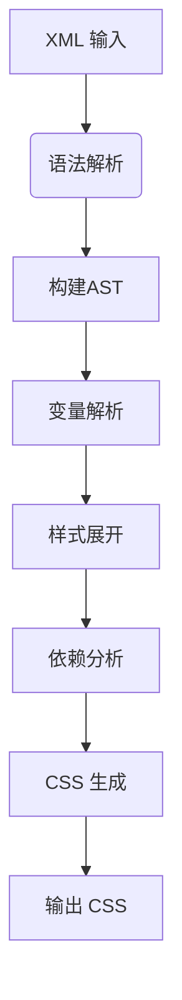

import {Conversation, Ask, Reply, Note} from '@site/src/components/Conversation';

<Conversation
asker={{ img: '/img/avatar/anonymous.svg' }}
replier={{ img: '/img/avatar/deepseek.svg' }}>

<Ask>

## Web 端的主题实现机制 {#theme-on-web}

</Ask>

<Reply>

Web 端的主题实现机制通常涉及 CSS、JavaScript 和可能的服务端技术，
目的是实现动态切换页面样式（如颜色、字体、布局等）。以下是常见的实现方式及技术细节：

<br/>

---

### 1. **CSS 变量（Custom Properties）** {#theme-on-web-by-custom-props}

- **核心机制**：通过定义 CSS 变量（如 `--primary-color`）并在样式中引用这些变量，
  动态修改变量值即可全局改变主题。
- **实现步骤**：
  1. **定义变量**：
  ```css
  :root {
    --primary-color: #3498db;
    --background-color: #ffffff;
  }
  ```
  2. **引用变量**：
  ```css
  body {
    background-color: var(--background-color);
  }
  button {
    background-color: var(--primary-color);
  }
  ```
  3. **切换变量**（通过 JavaScript）：
  ```javascript
  // 切换到暗色主题
  document.documentElement.style.setProperty('--primary-color', '#2c3e50');
  document.documentElement.style.setProperty('--background-color', '#1a1a1a');
  ```
- **优点**：轻量级、无需加载额外 CSS 文件，适合简单主题切换。

<br/>

---

### 2. **CSS 预处理器（Sass/Less）生成多套主题** {#theme-on-web-by-preprocessor}

- **核心机制**：通过预处理器（如 Sass）生成多套主题的 CSS 文件，通过切换 CSS 类名或文件实现主题变更。
- **实现步骤**：

  1. 使用变量定义主题：

  ```scss
  // light-theme.scss
  $primary-color: #3498db;
  $background-color: #ffffff;

  // dark-theme.scss
  $primary-color: #2c3e50;
  $background-color: #1a1a1a;
  ```

  2. 编译为独立 CSS 文件（如 `light-theme.css` 和 `dark-theme.css`）。
  3. 通过 JavaScript 动态切换 CSS 文件：

  ```javascript
  function switchTheme(themeName) {
    const link = document.getElementById('theme-style');
    link.href = `${themeName}.css`;
  }
  ```

- **缺点**：需预先生成多套 CSS，可能增加加载时间。

<br/>

---

### 3. **CSS 类名控制** {#theme-on-web-by-css-class}

- **核心机制**：通过为 HTML 根元素（如 `<html>` 或 `<body>`）添加不同的类名（如
  `theme-dark`），触发对应的 CSS 样式。
- **实现步骤**：
  1. 定义不同类名下的样式：
  ```css
  body.theme-light {
    --primary-color: #3498db;
    --background-color: white;
  }
  body.theme-dark {
    --primary-color: #2c3e50;
    --background-color: #1a1a1a;
  }
  ```
  2. 通过 JavaScript 切换类名：
  ```javascript
  document.body.classList.remove('theme-light');
  document.body.classList.add('theme-dark');
  ```
- **优点**：简单高效，结合 CSS 变量更灵活。

<br/>

---

### 4. **通过 `prefers-color-scheme` 适配系统主题** {#theme-on-web-by-prefers-color-scheme}

- **核心机制**：使用 CSS 媒体查询 `@media (prefers-color-scheme: dark)` 自动匹配用户系统主题。
- **实现示例**：

  ```css
  :root {
    --primary-color: #3498db;
    --background-color: #ffffff;
  }

  @media (prefers-color-scheme: dark) {
    :root {
      --primary-color: #2c3e50;
      --background-color: #1a1a1a;
    }
  }
  ```

- **局限**：仅响应系统设置，无法手动切换。

<br/>

---

### 5. **JavaScript 动态主题切换** {#theme-on-web-by-js}

- **核心机制**：结合 CSS 变量或类名，通过 JavaScript 动态修改主题并保存用户偏好。
- **实现示例**：

  ```javascript
  // 切换主题函数
  function toggleTheme() {
    const body = document.body;
    body.classList.toggle('dark-theme');
    // 保存到 localStorage
    const isDark = body.classList.contains('dark-theme');
    localStorage.setItem('theme', isDark ? 'dark' : 'light');
  }

  // 初始化时读取主题
  const savedTheme = localStorage.getItem('theme');
  if (savedTheme === 'dark') {
    document.body.classList.add('dark-theme');
  }
  ```

- **存储方式**：`localStorage`、`Cookie` 或后端数据库。

<br/>

---

### 6. **服务端主题渲染（SSR 场景）** {#theme-on-web-by-ssr}

- **核心机制**：在服务端根据用户设置（如 Cookie）返回不同主题的 HTML 或 CSS。
- **实现示例**：
  1. 用户通过 Cookie 传递主题偏好（如 `theme=dark`）。
  2. 服务端渲染时动态添加类名或内联样式：
  ```html
  <body class="<% if (theme === 'dark') { %>dark-theme<% } %>"></body>
  ```
- **优点**：避免页面闪烁（FOUC）。

<br/>

---

### 7. **主题切换的视觉过渡** {#theme-on-web-transition}

- **平滑动画**：通过 CSS `transition` 属性让主题切换更自然。
  ```css
  body {
    transition: background-color 0.3s ease, color 0.3s ease;
  }
  ```

<br/>

---

### 注意事项 {#theme-on-web-notices}

1. **回退方案**：确保在不支持 CSS 变量的浏览器中有默认样式。
2. **性能优化**：避免频繁重绘（如减少 `box-shadow` 变化）。
3. **可访问性**：主题切换不应影响文字对比度（满足 WCAG 标准）。

<br/>

---

### 高级方案 {#theme-on-web-advance}

- **CSS-in-JS**：使用 styled-components 或 Emotion 等库动态生成样式。
- **CSS 属性级控制**：通过 `color-scheme` 属性适配表单控件主题。
- **用户自定义主题**：允许用户通过颜色选择器自定义变量值。

通过上述机制的组合，可以实现灵活、高效且用户友好的主题系统。

</Reply>

<Ask>

## Android 端的主题实现机制 {#theme-on-android}

</Ask>

<Reply>

在 Android 端，主题（Themes）和样式（Styles）的实现机制与 Web 端有显著差异，
主要依赖于 Android 的资源系统（Resource System）和 XML 定义。
以下是 Android 主题的实现机制及关键细节：

<br/>

---

### **1. 主题（Themes）与样式（Styles）的区别** {#theme-on-android-diff-theme-and-style}

- **样式（Styles）**：定义一组属性（如文本大小、颜色、边距）的集合，用于单个视图（View）的外观。
- **主题（Themes）**：定义全局属性集合，应用于整个应用或 Activity，
  影响所有组件（如状态栏、导航栏、默认按钮样式等）。

<br/>

---

### **2. 主题的实现机制** {#theme-on-android-implement}

#### **(1) 在 `res/values/themes.xml` 中定义主题** {#theme-on-android-implement-by-xml}

通过 XML 文件定义主题，继承自系统主题（如 `Theme.Material3.DayNight`）并覆盖属性：

```xml
<!-- 亮色主题 -->
<style name="AppTheme.Light" parent="Theme.Material3.DayNight.NoActionBar">
  <item name="colorPrimary">@color/primary</item>
  <item name="colorOnPrimary">@color/on_primary</item>
  <item name="colorSurface">@color/background_light</item>
</style>

<!-- 暗色主题 -->
<style name="AppTheme.Dark" parent="Theme.Material3.DayNight.NoActionBar">
  <item name="colorPrimary">@color/primary_dark</item>
  <item name="colorOnPrimary">@color/on_primary_dark</item>
  <item name="colorSurface">@color/background_dark</item>
</style>
```

#### **(2) 应用主题** {#theme-on-android-implement-apply}

在 `AndroidManifest.xml` 中为应用或 Activity 指定默认主题：

```xml
<application
  android:theme="@style/AppTheme.Light">
  <!-- ... -->
</application>
```

<br/>

---

### **3. 动态主题切换（如夜间模式）** {#theme-on-android-theme-switch}

Android 提供了对深色主题（Dark Theme）的原生支持，可通过以下方式实现动态切换：

#### **(1) 使用 `AppCompatDelegate`** {#theme-on-android-theme-switch-code}

通过 `AppCompatDelegate.setDefaultNightMode()` 动态切换主题模式：

```kotlin
// 切换到深色模式
AppCompatDelegate.setDefaultNightMode(AppCompatDelegate.MODE_NIGHT_YES)

// 切换到浅色模式
AppCompatDelegate.setDefaultNightMode(AppCompatDelegate.MODE_NIGHT_NO)

// 跟随系统设置
AppCompatDelegate.setDefaultNightMode(AppCompatDelegate.MODE_NIGHT_FOLLOW_SYSTEM)
```

#### **(2) 重启 Activity 使主题生效** {#theme-on-android-theme-switch-recreate}

切换主题后需重启当前 Activity：

```kotlin
activity.recreate()
```

#### **(3) 保存用户偏好** {#theme-on-android-theme-switch-save}

使用 `SharedPreferences` 保存用户选择的主题模式：

```kotlin
val preferences = getSharedPreferences("settings", Context.MODE_PRIVATE)
preferences.edit().putInt("theme_mode", mode).apply()
```

<br/>

---

### **4. 主题与 Material Design 组件集成** {#theme-on-android-with-material}

Material Design 组件库（MDC）提供了深度主题化支持：

#### **(1) 颜色系统** {#theme-on-android-with-material-color}

- **语义颜色**：通过 `colorPrimary`、`colorSecondary` 等属性定义主题颜色。
- **颜色角色**：使用 `colorOnPrimary`（在 `colorPrimary` 上的文本颜色）、`colorSurface`（背景色）等。

#### **(2) 形状系统** {#theme-on-android-with-material-shape}

定义全局形状（如圆角）：

```xml
<style name="AppTheme" parent="Theme.Material3.DayNight">
  <item name="shapeAppearanceSmallComponent">@style/ShapeAppearance.SmallComponent</item>
  <item name="shapeAppearanceMediumComponent">@style/ShapeAppearance.MediumComponent</item>
</style>
```

#### **(3) 排版系统** {#theme-on-android-with-material-text}

通过 `textAppearance` 定义全局字体和文字样式：

```xml
<style name="TextAppearance.Body" parent="TextAppearance.Material3.BodyMedium">
  <item name="fontFamily">@font/roboto</item>
  <item name="android:textSize">16sp</item>
</style>
```

<br/>

---

### **5. 多主题资源管理** {#theme-on-android-mutiple}

Android 通过资源限定符（Qualifiers）自动加载不同主题资源：

- **夜间模式资源**：将暗色主题资源放在 `res/values-night` 目录中。
- **自定义主题资源**：通过资源限定符（如 `values-theme-red`）实现多主题。

<br/>

---

### **6. 动态主题属性（Theme Overlay）** {#theme-on-android-overlay}

通过 `ThemeOverlay` 覆盖特定组件的样式，无需修改全局主题：

```xml
<style name="ThemeOverlay.RedButton" parent="">
  <item name="colorPrimary">@color/red</item>
</style>

<!-- 在布局中应用 -->
<Button
    android:theme="@style/ThemeOverlay.RedButton"
    android:text="Red Button" />
```

<br/>

---

### **7. 自定义主题属性** {#theme-on-android-custom}

定义自定义主题属性供组件使用：

1. **在 `res/values/attrs.xml` 中定义属性**：

```xml
<resources>
  <attr name="customColor" format="color|reference" />
</resources>
```

2. **在主题中设置属性值**：

```xml
<style name="AppTheme" parent="Theme.Material3">
  <item name="customColor">@color/red</item>
</style>
```

3. **在代码或布局中使用**：

```kotlin
val typedValue = TypedValue()
context.theme.resolveAttribute(R.attr.customColor, typedValue, true)
val color = typedValue.data
```

<br/>

---

### **8. 兼容性处理** {#theme-on-android-compat}

- **旧版本兼容**：使用 `AppCompat` 主题（如 `Theme.AppCompat.DayNight`）支持 Android 5.0+。
- **动态颜色（Android 12+）**：通过 `dynamicColor` 适配系统动态主题：
  ```xml
  <item name="android:dynamicColorThemeOverlay">@style/ThemeOverlay.DynamicColors</item>
  ```

<br/>

---

### **9. 常见问题与优化** {#theme-on-android-notices}

1. **避免主题泄露**：在自定义视图中正确使用 `ContextThemeWrapper`。
2. **性能优化**：减少主题切换时的布局重绘。
3. **测试多主题**：使用 Android Studio 的 **Layout Inspector** 或 **Emulator** 验证不同主题效果。

<br/>

---

### 示例：完整动态主题切换 {#theme-on-android-demo}

```kotlin
// 保存主题模式
fun saveThemeMode(context: Context, mode: Int) {
  val preferences = context.getSharedPreferences("settings", Context.MODE_PRIVATE)
  preferences.edit().putInt("theme_mode", mode).apply()
}

// 加载主题模式
fun applySavedTheme(context: Context) {
  val preferences = context.getSharedPreferences("settings", Context.MODE_PRIVATE)
  val mode = preferences.getInt("theme_mode", AppCompatDelegate.MODE_NIGHT_FOLLOW_SYSTEM)
  AppCompatDelegate.setDefaultNightMode(mode)
}

// 在 Activity 的 onCreate 中调用
override fun onCreate(savedInstanceState: Bundle?) {
  super.onCreate(savedInstanceState)
  applySavedTheme(this)
  setContentView(R.layout.activity_main)
}
```

<br/>

---

### 总结 {#theme-on-android-summary}

Android 主题的实现机制基于资源系统、XML 定义和 Material Design 组件，通过以下核心步骤：

1. **定义主题**：覆盖颜色、形状、排版等属性。
2. **动态切换**：使用 `AppCompatDelegate` 和 `recreate()`。
3. **资源管理**：通过限定符加载不同主题资源。
4. **深度定制**：利用 `ThemeOverlay` 和自定义属性。

结合 Material Design 3 的动态颜色和组件主题化能力，可构建高度灵活且视觉统一的应用主题系统。

</Reply>

<Ask>

## XML 编写函数式自举 CSS {#xml-function-css}

以 xml 设计一套新的 html css 系统，其可以像函数一样向自定义的样式传递动态参数，
并且样式之间可以相互引用，类似于函数内调用其他函数，实现样式的自举，
只需要保证结构的完备性，最终由专门的编译器将其结构变换为真实的 css 定义。
要求样式名称作为 xml 标签名，样式参数为 xml 标签属性，嵌套样式作为子节点，
同时，在变量节点内定义变量，用以支持定义不同的主题

</Ask>

<Reply>

以下是基于 XML 设计的 HTML/CSS 函数式样式系统方案，支持动态参数传递、样式嵌套引用和主题变量定义：

```xml
<!-- 样式系统根节点 -->
<StyleSystem>
  <!-- 定义变量集合（主题） -->
  <Variables name="light-theme">
    <color.primary>#3498db</color.primary>
    <color.background>#ffffff</color.background>
    <spacing.unit>8px</spacing.unit>
  </Variables>

  <Variables name="dark-theme">
    <color.primary>#2c3e50</color.primary>
    <color.background>#1a1a1a</color.background>
  </Variables>

  <!-- 基础样式定义 -->
  <FlexLayout direction="column" gap="@{spacing.unit}">
    <Margin value="@{spacing.unit}"/>
    <Padding value="@{spacing.unit} * 2"/>
  </FlexLayout>

  <!-- 按钮组件样式 -->
  <ButtonStyle base="FlexLayout">
    <Background color="@color.primary"/>
    <Border radius="4px"/>

    <!-- 嵌套子样式 -->
    <HoverEffect>
      <Background color="darken(@color.primary, 10%)"/>
    </HoverEffect>

    <!-- 状态变体 -->
    <Variant name="secondary">
      <Background color="lighten(@color.primary, 20%)"/>
    </Variant>
  </ButtonStyle>

  <!-- 卡片组件样式 -->
  <CardStyle>
    <UseStyle name="FlexLayout"/>
    <Shadow level="2"/>
    <Border radius="8px"/>
    <Background color="@color.background"/>
  </CardStyle>
</StyleSystem>
```

<br/>

---

### **1. XML 结构规范** {#xml-function-css-spec}

| 节点            | 说明                              | 示例                             |
| --------------- | --------------------------------- | -------------------------------- |
| `<StyleSystem>` | 根节点，包含所有样式定义          | 整个文档根节点                   |
| `<Variables>`   | 定义变量集合（主题）              | `<Variables name="theme">...`    |
| `<StyleName>`   | 自定义样式标签（最终生成 CSS 类） | `<ButtonStyle>...</ButtonStyle>` |
| `<UseStyle>`    | 引用其他样式                      | `<UseStyle name="FlexLayout"/>`  |
| `<Variant>`     | 定义样式变体                      | `<Variant name="disabled">...`   |
| 属性值语法      | 使用 `@{}` 包裹动态表达式           | `gap="@{spacing.unit} * 2"`      |

<br/>

---

### **2. 编译器工作流程** {#xml-function-css-compile}



#### **关键处理步骤：** {#xml-function-css-compile-steps}

1. **变量解析**

- 替换所有 `@variable` 为实际值
- 支持表达式计算：`darken(@color.primary, 10%)`

2. **样式展开**

- 展开 `<UseStyle>` 为对应样式定义
- 处理嵌套样式形成级联关系

3. **依赖分析**

- 检测循环引用
- 确定样式生成顺序

4. **CSS 生成**

- 转换样式节点为 CSS 类
- 处理变体生成修饰符类

<br/>

---

### **3. 编译结果示例** {#xml-function-css-artifact}

输入 XML：

```xml
<ButtonStyle>
  <Background color="@color.primary"/>
  <Border radius="4px"/>
</ButtonStyle>
```

输出 CSS：

```css
.ButtonStyle {
  background-color: var(--color-primary);
  border-radius: 4px;
}

.ButtonStyle:hover {
  /* HoverEffect 展开结果 */
  background-color: #2980b9;
}

.ButtonStyle.secondary {
  background-color: #5dade2;
}
```

<br/>

---

### **4. 核心特性实现** {#xml-function-css-feature}

#### **(1) 动态参数传递** {#xml-function-css-feature-args}

```xml
<ResponsiveLayout breakpoints="sm:640px, md:768px">
  <MediaQuery name="sm">
    <Padding value="@{spacing.unit}"/>
  </MediaQuery>
  <MediaQuery name="md">
    <Padding value="@{spacing.unit} * 2"/>
  </MediaQuery>
</ResponsiveLayout>
```

#### **(2) 样式自举机制** {#xml-function-css-feature-self}

```xml
<BaseTypography>
  <FontFamily>system-ui</FontFamily>
  <LineHeight>1.5</LineHeight>
</BaseTypography>

<HeadingStyle base="BaseTypography">
  <FontSize>2rem</FontSize>
  <FontWeight>700</FontWeight>
</HeadingStyle>
```

#### **(3) 主题切换支持** {#xml-function-css-feature-theme}

```xml
<!-- 编译时指定主题 -->
<CompilerConfig>
  <ActiveTheme>dark-theme</ActiveTheme>
</CompilerConfig>
```

<br/>

---

### **5. 系统优势** {#xml-function-css-good}

| 特性           | 传统 CSS              | 本方案                  |
| -------------- | --------------------- | ----------------------- |
| **参数传递**   | 通过 CSS 变量实现     | XML 属性直接传递        |
| **样式组合**   | @apply 规则（已废弃） | 显式 `<UseStyle>` 引用  |
| **主题管理**   | 多个 CSS 文件切换     | 变量集合统一管理        |
| **响应式支持** | 媒体查询重复编写      | 声明式 breakpoints 系统 |
| **可读性**     | 选择器嵌套复杂        | 显式 XML 结构           |

<br/>

---

### **6. 高级功能扩展** {#xml-function-css-advance}

#### **(1) 条件样式** {#xml-function-css-advance-when}

```xml
<FeatureToggle name="darkMode">
  <When enabled="true">
    <Background color="#1a1a1a"/>
  </When>
  <Otherwise>
    <Background color="#ffffff"/>
  </Otherwise>
</FeatureToggle>
```

#### **(2) 循环生成** {#xml-function-css-advance-for}

```xml
<GenerateSpacingUnits from="1" to="5" step="1">
  <Spacing name="unit-@{value}" value="@{spacing.base} * @{value}"/>
</GenerateSpacingUnits>
```

#### **(3) 类型校验** {#xml-function-css-advance-validate}

```xml
<ColorValidator value="@color.primary">
  <AllowedFormats>hex, rgb</AllowedFormats>
  <MinimumContrast>4.5:1</MinimumContrast>
</ColorValidator>
```

<br/>

---

### **7. 完整编译示例** {#xml-function-css-demo}

输入 XML：

```xml
<StyleSystem>
  <Variables name="theme">
    <spacing.base>8px</spacing.base>
  </Variables>

  <FlexContainer gap="@{spacing.base}">
    <Margin all="@{spacing.base}"/>
  </FlexContainer>

  <CardLayout base="FlexContainer">
    <Padding value="@{spacing.base} * 2"/>
    <Shadow level="2"/>
  </CardLayout>
</StyleSystem>
```

输出 CSS：

```css
.FlexContainer {
  display: flex;
  gap: 8px;
  margin: 8px;
}

.CardLayout {
  padding: 16px;
  box-shadow: 0 4px 8px rgba(0, 0, 0, 0.1);
}
```

<br/>

---

### **8. 错误处理机制** {#xml-function-css-error}

#### **(1) 循环引用检测** {#xml-function-css-error-recycle}

```log
[ERROR] Circular dependency detected:
ButtonStyle → HoverEffect → ButtonStyle
```

#### **(2) 未定义变量警告** {#xml-function-css-error-undefined}

```log
[WARN] Undefined variable '@color.accent'
Used in: CardStyle > Background
```

#### **(3) 类型校验失败** {#xml-function-css-error-invalid}

```log
[ERROR] Invalid color format '#xyz'
Expected formats: hex, rgb
```

<br/>

---

### 总结 {#xml-function-css-summary}

该 XML 样式系统通过以下创新点实现设计目标：

1. **声明式语法**：通过 XML 标签结构直观描述样式关系
2. **动态参数引擎**：支持变量传递和表达式计算
3. **自举架构**：通过基础样式组合构建复杂组件
4. **主题隔离**：通过变量集合实现多主题支持
5. **编译时验证**：内置类型检查和依赖分析

最终通过编译器生成高效、可维护的标准 CSS，同时保留了源语言的可读性和灵活性。

</Reply>

</Conversation>
