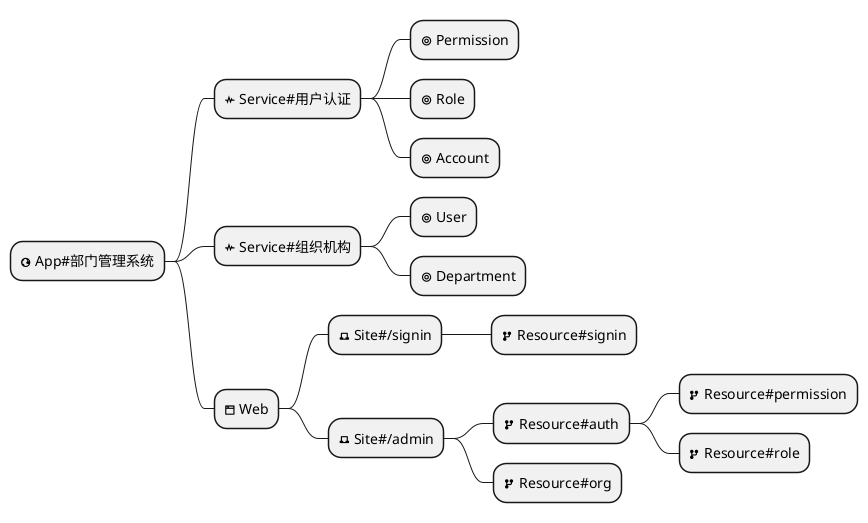

import Header from '@site/docs/\_header.md';

<Header />

- 设计并生成 XMeta 模型
- 根据 XMeta 生成 GraphQL 后端，并验证接口的数据读写功能
  - 以 H2 作为测试库
- 以单体模式设计应用各个部分，在需要时可以按模块分组，
  并在部署前确定是以单体模式，还是微服务模式部署，
  再根据部署模式构建单体或各个微服务
  - 部署信息标注在**部署模型**上，其结构由 DSL 设计器维护
- 在指定位置存放 XDef、XDsl 定义，在将其解析为设计器的 DSL
  结构后，再通过设计器维护其结构
  - 由渡舟平台统一存放定义文件，在构建应用时识别应用所需要的定义，
    再将其打包进 jar，后续有更新时，再通过配置中心下发变更
- 可视化部分，采用树形结构来展示和设计应用，在 DSL
  的配置中可跳转到页面设计器、接口设计器等工具
  - 在节点上通过附加属性 `task:status` 来标示该节点为任务节点，
    该属性的值为该任务的状态，节点的唯一标识为任务的标识，
    当前的 DSL 树即为父子任务树
  - 在设计器中通过「加入待办」按钮将指定节点添加为待办任务节点
  - 调用任务创建接口，从指定 DSL 中抽取任务结构并保存。
    对任务的状态、进度等更新，则需调用任务更新接口进行处理
  - 在设计器侧，以属性分组形式展示可调整的待办任务属性（状态等）
  - 待办任务名称默认引用 DSL 节点上的显示名称，在任务的 DSL
    中引用源 DSL 的 `i18n` 文件，并以与源 DSL
    一样的方式标记需国际化的属性：`<task i18n:name="app.service.user-auth.name" />`
- 同时提供图形化编辑和 Tree 结构编辑模式
- 设计器识别的是自身所支持的 DSL 模型，但其设计产物的 DSL 与目标 DSL
  是可以相互转换的，也就是从**设计器 DSL**可以转换为**目标 DSL**，
  而从**目标 DSL**也能够转换到**设计器 DSL**

<!-- https://plantuml.com/mindmap-diagram -->

## 可视化的目的

- 由设计器自动分析得到 DSL 模型属性的类型和可选值等填充信息，降低人脑记忆成本
- 由设计器识别 DSL 模型之间的引用关系和主次、先后关系，提高设计结果的准确性
- 由设计器统一管理 DSL 及其差量的分层，尽可能地屏蔽底层的实现细节内容
