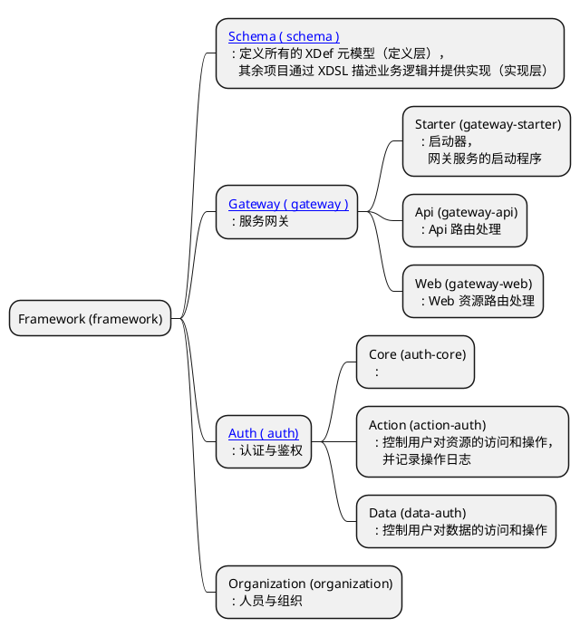

import DocCardList from '@theme/DocCardList';

<!-- https://plantuml.com/mindmap-diagram -->

```plantuml
@startmindmap
* Framework (framework)

**: [[./schema Schema ( schema )]]
  : 定义所有的 XDef 元模型（定义层），
    其余项目通过 XDSL 描述业务逻辑并提供实现（实现层）;

**: [[./gateway Gateway ( gateway )]]
  : 服务网关;
***: Starter (gateway-starter)
   : 启动器，
     网关服务的启动程序;
***: Api (gateway-api)
   : Api 路由处理;
***: Web (gateway-web)
   : Web 资源路由处理;

**: [[./auth Auth ( auth)]]
  : 认证与鉴权;
***: Core (auth-core)
   : ;
***: Action (action-auth)
   : 控制用户对资源的访问和操作，
     并记录操作日志;
***: Data (data-auth)
   : 控制用户对数据的访问和操作;

**: Organization (organization)
  : 人员与组织;
@endmindmap
```

> Maven 工程模块目录添加数字前缀以控制目录顺序，
> 模块目录按重要性排序。

<DocCardList />
