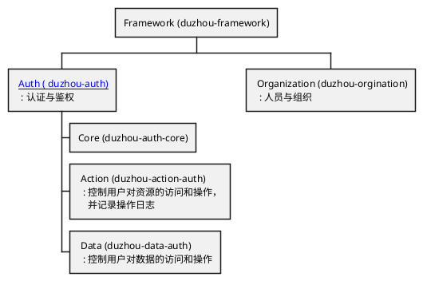

import DocCardList from '@theme/DocCardList';

<!-- https://plantuml.com/wbs-diagram -->

```plantuml
@startwbs
* Framework (duzhou-framework)

**: [[./auth Auth ( duzhou-auth)]]
  : 认证与鉴权;
*** Core (duzhou-auth-core)
***: Action (duzhou-action-auth)
  : 控制用户对资源的访问和操作，
    并记录操作日志;
***: Data (duzhou-data-auth)
  : 控制用户对数据的访问和操作;

**: Organization (duzhou-orgination)
  : 人员与组织;
@endwbs
```

> Maven 工程模块目录可以添加数字前缀以控制目录顺序。

<DocCardList />
