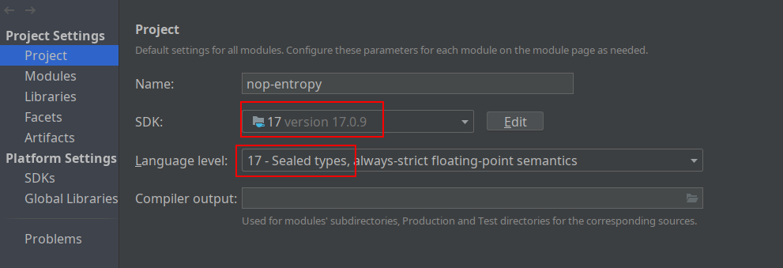

import Header from '@site/docs/\_header.md';

<Header />

## 本地开发

环境要求：

- JDK 17+
- Maven 3.9.3+

本地构建并发布：

```bash
export JAVA_HOME=/usr/lib/jvm/java-17-openjdk

mvn clean install -DskipTests -Dquarkus.package.type=uber-jar
```

> 以上命令也是为了便于拉取 Maven 依赖包，避免 IDEA 下载依赖出现问题。

在 IDEA 导入项目后，需调整项目配置（File -> Project Structure...）：



> 确保 IDEA 的 Maven 配置（File -> Settings -> Build, Execution, Deployment -> Maven -> Local repository）
> 指向了与 `mvn` 命令相同的仓库路径。

## 构建 IDEA 插件

```bash
cd nop-idea-plugin

export JAVA_HOME=/usr/lib/jvm/java-17-openjdk

bash ./gradlew buildPlugin
```

构建完成后，进入 IDEA 的插件管理（`File -> Settings -> Plugins`），
点击齿轮图标，并选择 `Install Plugin from Disk ...`，再选中构建的插件
`nop-idea-plugin/build/distributions/nop-idea-plugin-1.0-SNAPSHOT.zip`
以安装到 IDEA 中。
